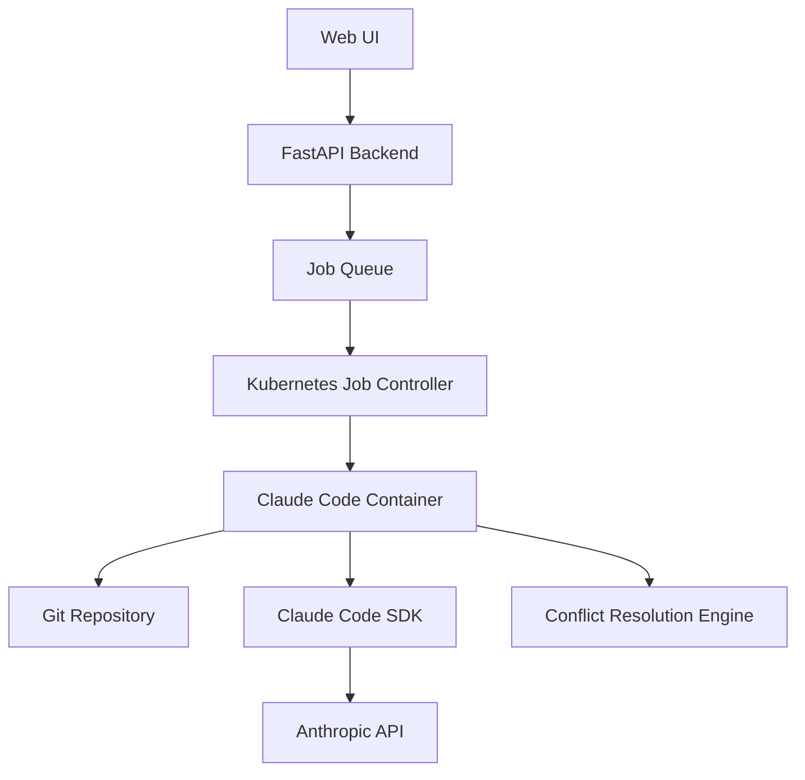

# Claude Code Orchestration Tool - Architecture Plan

## Executive Summary

This document outlines the architecture and implementation plan for a web-based Claude Code orchestration tool that runs Claude Code in isolated Docker containers with automated Git workflow integration. The solution prioritizes minimal code implementation while leveraging existing tools and libraries.

## Core Requirements

1. Web-based orchestration interface
2. Run Claude Code in isolated Docker containers
3. Pull code repository on container startup
4. Execute Claude Code tasks
5. Automated rebase onto selected branch
6. Claude-assisted conflict resolution when rebase fails
7. Push successful changes to remote

## Recommended Architecture

### 1. Container Orchestration: Kubernetes Jobs (through kind during development)

**Rationale**: 
- Native support for one-off tasks through Jobs API
- Better suited for ephemeral workloads than Docker Swarm
- Built-in job completion tracking and retry mechanisms
- Scalable and production-ready

**Alternative**: Docker Compose for simpler deployments (development/small scale)

### 2. Container Design: Modified Dev Containers

**Approach**: Extend the Development Container specification with Claude Code integration

**Benefits**:
- Standardized container configuration format
- Existing tooling and ecosystem
- Support for multi-container setups via Docker Compose
- Easy integration with VS Code and other IDEs

**Implementation**:
```json
{
  "name": "Claude Code Orchestration",
  "image": "claude-code-orchestration:latest",
  "postStartCommand": "git clone ${REPO_URL} /workspace && cd /workspace",
  "features": {
    "ghcr.io/devcontainers/features/git:1": {},
    "ghcr.io/devcontainers/features/docker-in-docker:2": {}
  },
  "customizations": {
    "claude-code": {
      "apiKey": "${ANTHROPIC_API_KEY}",
      "mode": "non-interactive"
    }
  }
}
```

### 3. Claude Code Integration: SDK Approach

**Primary Method**: Claude Code SDK (TypeScript)
- Use `@anthropic-ai/claude-code` NPM package
- Run in non-interactive mode for automation
- Programmatic access to all Claude Code features

**Implementation Strategy**:
1. Create wrapper service around Claude Code SDK
2. Handle authentication via environment variables
3. Implement task queue for Claude Code operations
4. Log all operations for audit trail

### 4. Git Automation: GitPython + Custom Scripts

**Primary Library**: GitPython for high-level operations
**Conflict Resolution**: 
1. Attempt automatic rebase using GitPython
2. On conflict, parse conflict markers
3. Create Claude Code task to resolve conflicts
4. Apply Claude's suggestions programmatically
5. Continue rebase process

**Implementation Flow**:
```python
def automated_rebase(repo, target_branch):
    try:
        repo.git.rebase(target_branch)
    except GitCommandError as e:
        conflicts = parse_conflicts(repo)
        resolution = claude_resolve_conflicts(conflicts)
        apply_resolution(repo, resolution)
        repo.git.rebase('--continue')
```

### 5. Web Framework: FastAPI

**Rationale**:
- Minimal and high-performance
- Automatic API documentation
- Native async support for handling multiple jobs
- Easy Docker containerization
- Type safety with Python type hints

**API Endpoints**:
- `POST /jobs` - Create new Claude Code job
- `GET /jobs/{id}` - Get job status
- `GET /jobs/{id}/logs` - Stream job logs
- `POST /jobs/{id}/cancel` - Cancel running job

### 6. Job Execution Architecture



## Implementation Phases

### Phase 1: Core Infrastructure (Week 1-2)
1. Set up FastAPI backend with basic endpoints
2. Create Docker base image with Claude Code SDK
3. Implement Kubernetes Job templates
4. Basic job submission and tracking

### Phase 2: Git Integration (Week 3-4)
1. Implement GitPython wrapper for common operations
2. Create conflict detection and parsing logic
3. Build Claude Code conflict resolution prompts
4. Test automated rebase workflows

### Phase 3: Web UI & Monitoring (Week 5-6)
1. Build minimal React frontend
2. Implement real-time log streaming
3. Add job history and analytics
4. Create notification system for job completion

### Phase 4: Production Hardening (Week 7-8)
1. Add authentication and authorization
2. Implement rate limiting and quotas
3. Set up monitoring and alerting
4. Create backup and recovery procedures

## Minimal Implementation Path

For the absolute minimal viable product:

1. **Use Docker Compose** instead of Kubernetes
2. **CLI-first approach** with simple web wrapper
3. **Synchronous job execution** (no queue)
4. **Basic conflict resolution** (fail on complex conflicts)

```yaml
# docker-compose.yml
version: '3.8'
services:
  api:
    build: ./api
    environment:
      - ANTHROPIC_API_KEY=${ANTHROPIC_API_KEY}
    ports:
      - "8000:8000"
    volumes:
      - /var/run/docker.sock:/var/run/docker.sock
  
  claude-runner:
    build: ./claude-runner
    environment:
      - ANTHROPIC_API_KEY=${ANTHROPIC_API_KEY}
    volumes:
      - ./repos:/repos
```

## Security Considerations

1. **API Key Management**: Use Kubernetes Secrets or environment variables
2. **Container Isolation**: Run each job in isolated container with limited permissions
3. **Network Policies**: Restrict container network access
4. **Git Credentials**: Use temporary tokens with minimal permissions
5. **Rate Limiting**: Implement per-user quotas

## Monitoring & Observability

1. **Structured Logging**: JSON logs for all operations
2. **Metrics**: Job duration, success rate, conflict resolution stats
3. **Tracing**: OpenTelemetry integration for request tracking
4. **Dashboards**: Grafana for visualization

## Cost Optimization

1. **Container Reuse**: Cache base images with dependencies
2. **Resource Limits**: Set CPU/memory limits per job
3. **Automatic Cleanup**: Remove completed job containers
4. **API Call Optimization**: Batch Claude Code operations

## Conclusion

This architecture provides a scalable, maintainable solution for Claude Code orchestration with minimal custom code. By leveraging existing tools (Kubernetes Jobs, Dev Containers, FastAPI, GitPython), we can focus on the core integration logic while benefiting from battle-tested infrastructure components.

The modular design allows for incremental implementation, starting with a simple Docker Compose setup and evolving to a full Kubernetes deployment as requirements grow.