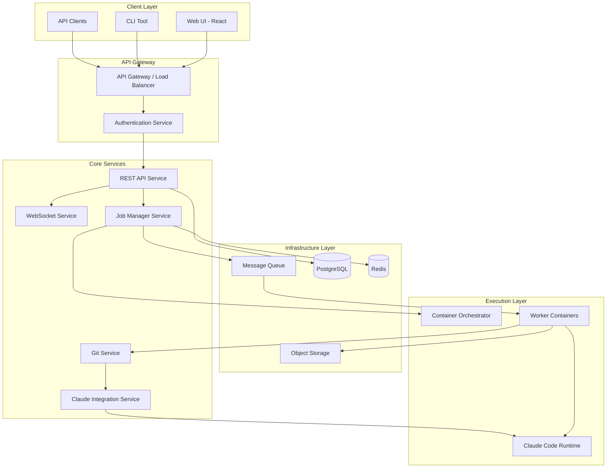

# FlowForge Architecture Overview

## Executive Summary

FlowForge is a web-based orchestration platform that enables automated execution of Claude Code tasks within isolated Docker containers, integrated with Git workflows for seamless code repository management. The system is designed with a microservices architecture that prioritizes security, scalability, and maintainability.

## Core Principles

1. **Container-First Design**: Every Claude Code execution runs in an isolated container environment
2. **Event-Driven Architecture**: Asynchronous job processing with real-time status updates
3. **API-First Approach**: RESTful APIs with WebSocket support for real-time features
4. **Security by Design**: Zero-trust architecture with strict isolation boundaries
5. **Cloud-Native**: Built for Kubernetes but deployable on any container platform

## System Overview

## Key Components

### 1. **Client Layer**
- **Web UI**: Modern React-based single-page application
- **CLI Tool**: Command-line interface for automation and CI/CD integration
- **API Clients**: SDKs for programmatic access (Python, TypeScript, Go)

### 2. **API Gateway**
- **Load Balancing**: Distributes requests across API instances
- **Authentication**: JWT-based authentication with OAuth2 support
- **Rate Limiting**: Protects against abuse and ensures fair usage
- **Request Routing**: Intelligent routing based on service health

### 3. **Core Services**

#### REST API Service
- Handles all CRUD operations for jobs, repositories, and configurations
- Implements RESTful principles with proper HTTP status codes
- Provides OpenAPI/Swagger documentation

#### WebSocket Service
- Real-time job status updates
- Live log streaming from containers
- Bidirectional communication for interactive features

#### Job Manager Service
- Orchestrates job lifecycle (creation, scheduling, execution, completion)
- Manages job queues and priorities
- Handles retry logic and failure recovery

#### Git Service
- Abstracts Git operations (clone, pull, push, rebase)
- Manages repository credentials securely
- Implements conflict resolution workflows

#### Claude Integration Service
- Wraps Claude Code SDK for consistent API
- Manages Claude API keys and rate limits
- Implements prompt engineering for conflict resolution

### 4. **Infrastructure Layer**

#### Message Queue (RabbitMQ/Redis Streams)
- Decouples job submission from execution
- Ensures reliable job processing
- Supports priority queues and delayed jobs

#### PostgreSQL Database
- Stores job metadata and history
- User accounts and permissions
- Repository configurations
- Audit logs

#### Redis Cache
- Session storage
- Real-time job status
- Temporary data and locks
- Rate limiting counters

#### Object Storage (S3-compatible)
- Job artifacts and logs
- Repository caches
- Backup storage

### 5. **Execution Layer**

#### Container Orchestrator
- Kubernetes Jobs for production
- Docker Compose for development
- Manages container lifecycle
- Resource allocation and limits

#### Worker Containers
- Isolated execution environment
- Pre-built with necessary tools
- Ephemeral and stateless
- Security-hardened base images

## Security Architecture

### Authentication & Authorization
- Multi-factor authentication support
- Role-based access control (RBAC)
- API key management for service accounts
- OAuth2 integration for SSO

### Container Security
- Read-only root filesystem
- Non-root user execution
- Network policies for isolation
- Secrets management via Kubernetes Secrets/Vault

### Data Security
- Encryption at rest for all sensitive data
- TLS 1.3 for all communications
- Temporary credentials for Git operations
- Audit logging for compliance

## Scalability Considerations

### Horizontal Scaling
- All services designed to be stateless
- Database connection pooling
- Cache-first architecture
- CDN for static assets

### Performance Optimization
- Lazy loading and pagination
- Efficient database queries with indexes
- Container image caching
- Job result caching

### High Availability
- Multi-region deployment support
- Database replication
- Service health checks
- Automatic failover

## Development Philosophy

### Minimal Code, Maximum Value
- Leverage existing libraries and frameworks
- Focus on integration rather than reimplementation
- Use proven patterns and practices
- Automate everything possible

### Progressive Enhancement
- Start with MVP functionality
- Add features based on user feedback
- Maintain backward compatibility
- Document all decisions

### Testing Strategy
- Unit tests for business logic
- Integration tests for services
- End-to-end tests for critical paths
- Performance benchmarks

## Next Steps

1. Review [System Components](02-system-components.md) for detailed component specifications
2. Examine [Data Flow](03-data-flow.md) for request lifecycle details
3. Check [Technology Stack](04-technology-stack.md) for implementation choices
4. See [Deployment Architecture](05-deployment-architecture.md) for production setup