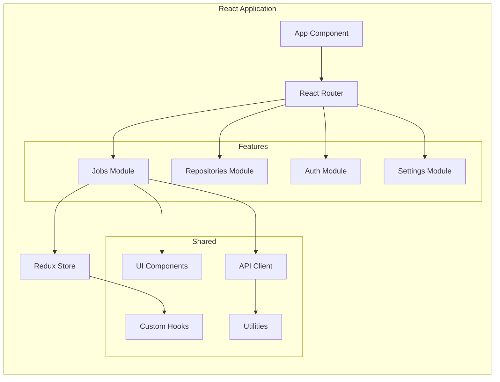
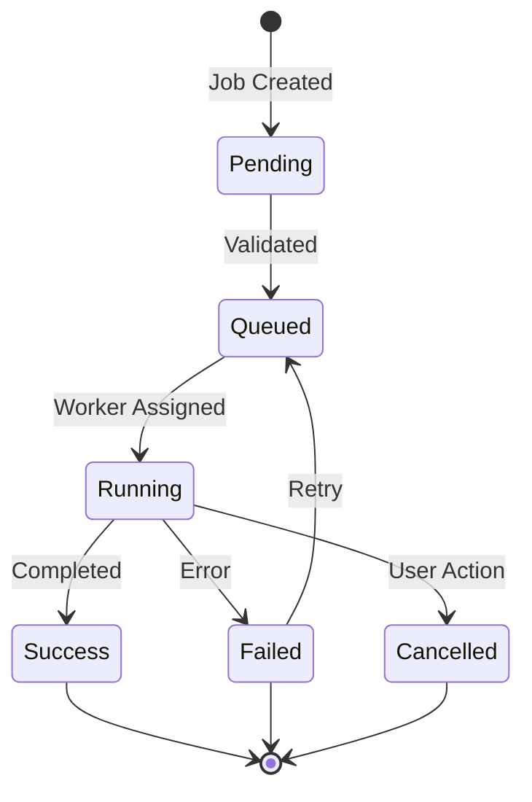
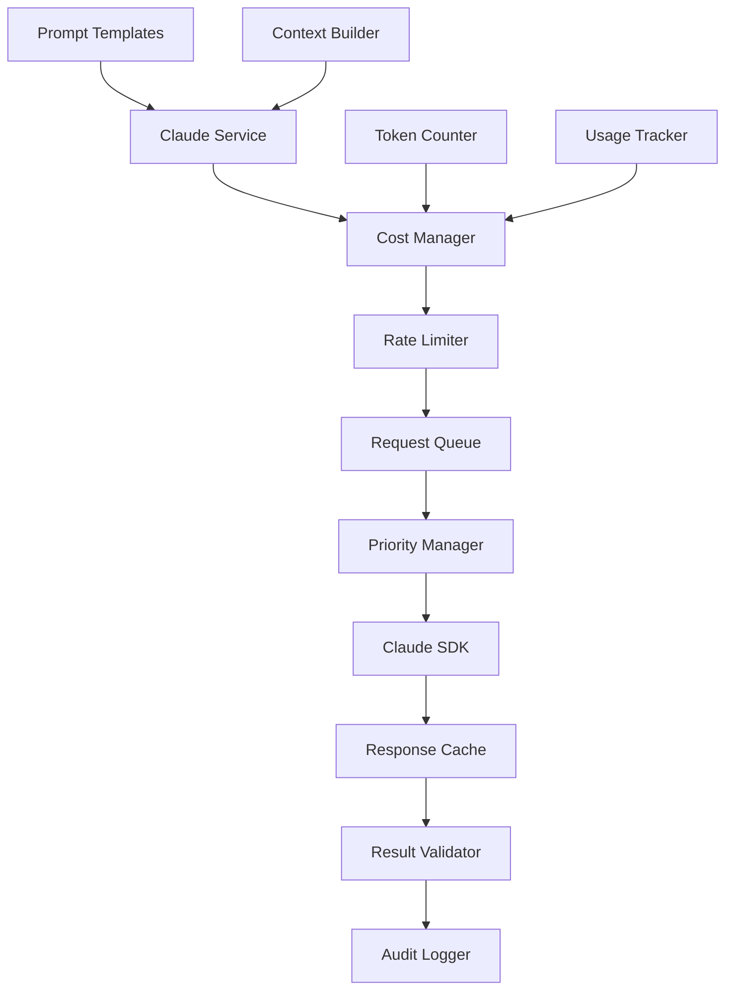

# FlowForge System Components

## Component Architecture

This document provides detailed specifications for each system component in the FlowForge architecture.

## Frontend Components

### Web UI (React Application)



**Key Features:**
- Real-time job monitoring with WebSocket integration
- Repository management interface
- User authentication and profile management
- System settings and configuration
- Dark mode support
- Responsive design for mobile devices

**Technical Stack:**
- React 18+ with TypeScript
- Redux Toolkit for state management
- React Query for server state
- Material-UI or Ant Design for components
- Socket.io client for WebSocket
- Vite for build tooling

### CLI Tool

**Architecture:**
```
flowforge/
├── cmd/
│   ├── job.go       # Job-related commands
│   ├── repo.go      # Repository commands
│   ├── auth.go      # Authentication
│   └── root.go      # Main entry point
├── pkg/
│   ├── client/      # API client
│   ├── config/      # Configuration
│   └── output/      # Output formatting
└── main.go
```

**Features:**
- Submit and monitor jobs
- Manage repositories
- Stream logs in real-time
- Export job results
- Scriptable with JSON output

## Backend Services

### API Gateway (Kong/Traefik)

**Enhanced Configuration with Comprehensive Rate Limiting:**
```yaml
routes:
  - path: /api/v1/*
    service: api-service
    plugins:
      - rate-limiting-advanced:
          policies:
            - name: global
              minute: 10000
              hour: 100000
            - name: per-user
              minute: 60
              hour: 1000
              day: 10000
            - name: per-ip
              minute: 30
              hour: 500
            - name: claude-api
              minute: 10  # Expensive operations
              hour: 100
              cost_based: true
          headers:
            X-RateLimit-Limit: true
            X-RateLimit-Remaining: true
            X-RateLimit-Reset: true
      - jwt-auth:
          secret: ${JWT_SECRET}
          claims_to_verify:
            - exp
            - nbf
      - cors:
          origins: ["https://app.flowforge.io"]
          credentials: true
      - request-transformer:
          add_headers:
            X-Request-ID: "{{uuid}}"
            X-Trace-ID: "{{trace_id}}"
```

**Features:**
- Request routing and load balancing
- Authentication and authorization
- Rate limiting and throttling
- Request/response transformation
- Monitoring and analytics

### REST API Service

**Endpoint Structure:**
```
/api/v1/
├── /auth
│   ├── POST   /login
│   ├── POST   /logout
│   ├── POST   /refresh
│   └── GET    /profile
├── /jobs
│   ├── GET    /         # List jobs
│   ├── POST   /         # Create job
│   ├── GET    /{id}     # Get job details
│   ├── DELETE /{id}     # Cancel job
│   └── GET    /{id}/logs # Get job logs
├── /repositories
│   ├── GET    /         # List repositories
│   ├── POST   /         # Add repository
│   ├── GET    /{id}     # Get repository
│   ├── PUT    /{id}     # Update repository
│   └── DELETE /{id}     # Remove repository
└── /webhooks
    └── POST   /github   # GitHub webhook
```

**Implementation Details:**
- FastAPI (Python) or Gin (Go) framework
- OpenAPI 3.0 specification
- Request validation with Pydantic/struct tags
- Structured logging with correlation IDs
- Prometheus metrics endpoint

### Job Manager Service



**Responsibilities:**
- Job lifecycle management
- Queue management and prioritization
- Worker assignment and monitoring
- Retry logic implementation
- Job result aggregation

**Job Schema:**
```typescript
interface Job {
  id: string;
  userId: string;
  repositoryId: string;
  status: JobStatus;
  config: {
    branch: string;
    targetBranch: string;
    task: string;
    environment: Record<string, string>;
  };
  metadata: {
    createdAt: Date;
    startedAt?: Date;
    completedAt?: Date;
    workerId?: string;
    attempts: number;
  };
  result?: {
    output: string;
    artifacts: string[];
    metrics: Record<string, number>;
  };
}
```

### Git Service

**Enhanced Git Service with Secure Conflict Resolution:**

```python
from typing import List, Optional, Dict
import ast
import subprocess
import hashlib

class SecureGitService:
    def __init__(self, validation_service, security_scanner):
        self.validation = validation_service
        self.security = security_scanner
        self.conflict_resolver = ConflictResolver()
        
    async def clone_repository(self, url: str, branch: str, depth: int = 1) -> Repository:
        """Clone repository with shallow depth and security checks"""
        # Validate repository URL
        if not self.security.validate_git_url(url):
            raise SecurityException("Invalid or unauthorized repository URL")
            
        # Clone with specific depth and single branch
        repo = await self._secure_clone(url, branch, depth)
        
        # Scan for security issues
        await self.security.scan_repository(repo)
        return repo
        
    async def rebase_with_validation(self, repo: Repository, target: str) -> RebaseResult:
        """Attempt rebase with comprehensive conflict resolution"""
        try:
            # Attempt automatic rebase
            result = await repo.git.rebase(target)
            return RebaseResult(success=True, conflicts=[])
        except GitConflictError as e:
            # Handle conflicts with validation
            conflicts = await self._parse_conflicts(repo)
            resolved_conflicts = await self.conflict_resolver.resolve_with_validation(
                conflicts, target
            )
            return RebaseResult(success=False, conflicts=resolved_conflicts)

class ConflictResolver:
    def __init__(self):
        self.validator = ConflictValidator()
        self.claude_service = ClaudeService()
        
    async def resolve_with_validation(self, conflicts: List[Conflict], target_branch: str) -> List[ResolvedConflict]:
        """Resolve conflicts with multiple validation layers"""
        resolved = []
        
        for conflict in conflicts:
            # Skip binary files
            if conflict.is_binary:
                resolved.append(ResolvedConflict(
                    conflict=conflict,
                    resolution_method="manual",
                    success=False,
                    error="Binary file conflicts require manual resolution"
                ))
                continue
                
            # Get Claude's suggestion
            claude_solution = await self._get_claude_resolution(conflict)
            
            # Validate the solution
            validation_result = await self.validator.validate_resolution(
                conflict, claude_solution
            )
            
            if validation_result.is_valid:
                # Apply the validated solution
                await self._apply_resolution(conflict, claude_solution)
                resolved.append(ResolvedConflict(
                    conflict=conflict,
                    resolution_method="claude_validated",
                    success=True,
                    solution=claude_solution
                ))
            else:
                # Fall back to safe resolution strategies
                fallback = await self._apply_fallback_strategy(conflict)
                resolved.append(fallback)
                
        return resolved

class ConflictValidator:
    def __init__(self):
        self.syntax_checkers = {
            '.py': self._validate_python,
            '.js': self._validate_javascript,
            '.go': self._validate_go,
            '.java': self._validate_java
        }
        
    async def validate_resolution(self, conflict: Conflict, solution: str) -> ValidationResult:
        """Multi-layer validation of conflict resolution"""
        results = []
        
        # 1. Syntax validation
        syntax_valid = await self._validate_syntax(conflict.file_path, solution)
        results.append(("syntax", syntax_valid))
        
        # 2. Security scan
        security_valid = await self._security_scan(solution)
        results.append(("security", security_valid))
        
        # 3. Semantic validation
        semantic_valid = await self._validate_semantics(conflict, solution)
        results.append(("semantics", semantic_valid))
        
        # 4. Test execution (if tests exist)
        if await self._has_tests(conflict.file_path):
            test_valid = await self._run_tests(conflict.file_path, solution)
            results.append(("tests", test_valid))
            
        return ValidationResult(
            is_valid=all(r[1] for r in results),
            details=results
        )
        
    async def _validate_python(self, code: str) -> bool:
        """Validate Python syntax"""
        try:
            ast.parse(code)
            return True
        except SyntaxError:
            return False
            
    async def _security_scan(self, code: str) -> bool:
        """Scan for security vulnerabilities"""
        suspicious_patterns = [
            r'exec\s*\(',
            r'eval\s*\(',
            r'__import__',
            r'subprocess\.call.*shell=True',
            r'os\.system',
            r'pickle\.loads',
        ]
        
        for pattern in suspicious_patterns:
            if re.search(pattern, code):
                return False
        return True
```

**Enhanced Conflict Resolution Flow:**
1. Parse conflict markers and identify file types
2. Skip binary files and mark for manual resolution
3. Extract comprehensive context (full function/class scope)
4. Generate Claude prompt with safety instructions
5. Validate Claude's response:
   - Syntax validation per language
   - Security vulnerability scanning
   - Semantic consistency checks
   - Unit test execution (if available)
6. Apply validated resolution or use fallback strategy
7. Log all resolutions for audit trail
8. Continue rebase with validated changes

### Claude Integration Service

**Enhanced Architecture with Cost Management:**


**Key Features:**
- Intelligent prompt construction with safety guidelines
- Context window management with token optimization
- Response caching with similarity matching
- Multi-tier rate limiting (user, organization, global)
- Cost tracking and budget enforcement
- Priority-based request queuing
- Comprehensive audit logging

**Enhanced Prompt Templates:**
```yaml
conflict_resolution:
  system: |
    You are helping resolve git merge conflicts in a secure environment.
    Your solutions must:
    1. Preserve the intent of both conflicting changes
    2. Maintain code correctness and safety
    3. Not introduce security vulnerabilities
    4. Follow the existing code style and patterns
    5. Be syntactically valid for the target language
    
    IMPORTANT: Do not include any code that:
    - Executes system commands
    - Evaluates dynamic code
    - Accesses external resources without validation
    - Contains hardcoded credentials or secrets
    
  user: |
    File: {file_path}
    Language: {language}
    Base branch: {base_branch}
    Current branch: {current_branch}
    
    Context before conflict:
    ```{language}
    {context_before}
    ```
    
    Conflict section:
    ```
    <<<<<<< {current_branch}
    {current_content}
    =======
    {base_content}
    >>>>>>> {base_branch}
    ```
    
    Context after conflict:
    ```{language}
    {context_after}
    ```
    
    Please provide a safe, validated resolution that merges both changes.
    
code_review:
  system: |
    You are reviewing code changes for security and quality.
    Focus on identifying potential issues and suggesting improvements.
```

**Cost Management Implementation:**
```python
class CostManager:
    def __init__(self, config):
        self.pricing = {
            'claude-3-opus': 0.015,    # per 1K tokens
            'claude-3-sonnet': 0.003,  # per 1K tokens
            'claude-3-haiku': 0.00025  # per 1K tokens
        }
        self.budgets = {}
        self.usage_tracker = UsageTracker()
        
    async def check_budget(self, user_id: str, estimated_tokens: int) -> BudgetCheck:
        """Check if user has budget for request"""
        user_budget = self.budgets.get(user_id, self.config.default_budget)
        current_usage = await self.usage_tracker.get_monthly_usage(user_id)
        estimated_cost = self._calculate_cost(estimated_tokens)
        
        if current_usage + estimated_cost > user_budget:
            return BudgetCheck(
                allowed=False,
                reason="Monthly budget exceeded",
                remaining_budget=user_budget - current_usage
            )
            
        return BudgetCheck(allowed=True, estimated_cost=estimated_cost)
        
    async def track_usage(self, user_id: str, tokens_used: int, model: str):
        """Track API usage for billing"""
        cost = self._calculate_cost(tokens_used, model)
        await self.usage_tracker.record_usage(
            user_id=user_id,
            tokens=tokens_used,
            cost=cost,
            model=model,
            timestamp=datetime.utcnow()
        )
```

## Data Layer

### Enhanced PostgreSQL Schema

```sql
-- Enable required extensions
CREATE EXTENSION IF NOT EXISTS "uuid-ossp";
CREATE EXTENSION IF NOT EXISTS "pg_stat_statements";
CREATE EXTENSION IF NOT EXISTS "pgcrypto";
CREATE EXTENSION IF NOT EXISTS "pg_partman";

-- Organizations table (for multi-tenancy)
CREATE TABLE organizations (
    id UUID PRIMARY KEY DEFAULT gen_random_uuid(),
    name VARCHAR(255) UNIQUE NOT NULL,
    slug VARCHAR(255) UNIQUE NOT NULL,
    settings JSONB DEFAULT '{}',
    created_at TIMESTAMP DEFAULT CURRENT_TIMESTAMP,
    updated_at TIMESTAMP DEFAULT CURRENT_TIMESTAMP
);

-- Users table with organization support
CREATE TABLE users (
    id UUID PRIMARY KEY DEFAULT gen_random_uuid(),
    email VARCHAR(255) UNIQUE NOT NULL,
    name VARCHAR(255),
    organization_id UUID REFERENCES organizations(id),
    role VARCHAR(50) DEFAULT 'user',
    settings JSONB DEFAULT '{}',
    created_at TIMESTAMP DEFAULT CURRENT_TIMESTAMP,
    updated_at TIMESTAMP DEFAULT CURRENT_TIMESTAMP
);

-- Repositories table with enhanced metadata
CREATE TABLE repositories (
    id UUID PRIMARY KEY DEFAULT gen_random_uuid(),
    organization_id UUID REFERENCES organizations(id),
    user_id UUID REFERENCES users(id),
    name VARCHAR(255) NOT NULL,
    url TEXT NOT NULL,
    default_branch VARCHAR(255) DEFAULT 'main',
    credentials JSONB, -- Encrypted
    settings JSONB DEFAULT '{}',
    is_active BOOLEAN DEFAULT true,
    last_synced_at TIMESTAMP,
    created_at TIMESTAMP DEFAULT CURRENT_TIMESTAMP,
    updated_at TIMESTAMP DEFAULT CURRENT_TIMESTAMP,
    UNIQUE(organization_id, name)
);

-- Jobs table with versioning
CREATE TABLE jobs (
    id UUID PRIMARY KEY DEFAULT gen_random_uuid(),
    organization_id UUID REFERENCES organizations(id),
    user_id UUID REFERENCES users(id),
    repository_id UUID REFERENCES repositories(id),
    parent_job_id UUID REFERENCES jobs(id), -- For retry chains
    status VARCHAR(50) NOT NULL,
    priority INTEGER DEFAULT 5,
    config JSONB NOT NULL,
    config_version INTEGER DEFAULT 1,
    result JSONB,
    error_message TEXT,
    retry_count INTEGER DEFAULT 0,
    max_retries INTEGER DEFAULT 3,
    created_at TIMESTAMP DEFAULT CURRENT_TIMESTAMP,
    queued_at TIMESTAMP,
    started_at TIMESTAMP,
    completed_at TIMESTAMP,
    canceled_at TIMESTAMP
);

-- Job execution history (partitioned by month)
CREATE TABLE job_executions (
    id UUID DEFAULT gen_random_uuid(),
    job_id UUID REFERENCES jobs(id),
    attempt_number INTEGER NOT NULL,
    worker_id VARCHAR(255),
    status VARCHAR(50) NOT NULL,
    started_at TIMESTAMP NOT NULL,
    completed_at TIMESTAMP,
    duration_ms INTEGER,
    error_message TEXT,
    logs_url TEXT,
    created_at TIMESTAMP DEFAULT CURRENT_TIMESTAMP,
    PRIMARY KEY (id, created_at)
) PARTITION BY RANGE (created_at);

-- Create monthly partitions
SELECT partman.create_parent(
    p_parent_table => 'public.job_executions',
    p_control => 'created_at',
    p_type => 'range',
    p_interval=> 'monthly'
);

-- Git operations audit
CREATE TABLE git_operations (
    id UUID PRIMARY KEY DEFAULT gen_random_uuid(),
    job_id UUID REFERENCES jobs(id),
    operation_type VARCHAR(50) NOT NULL, -- clone, pull, push, rebase, etc.
    repository_url TEXT,
    branch VARCHAR(255),
    target_branch VARCHAR(255),
    commit_sha VARCHAR(40),
    status VARCHAR(50) NOT NULL,
    duration_ms INTEGER,
    error_message TEXT,
    created_at TIMESTAMP DEFAULT CURRENT_TIMESTAMP
);

-- Conflict resolutions tracking
CREATE TABLE conflict_resolutions (
    id UUID PRIMARY KEY DEFAULT gen_random_uuid(),
    job_id UUID REFERENCES jobs(id),
    file_path TEXT NOT NULL,
    conflict_type VARCHAR(50),
    resolution_method VARCHAR(50), -- claude_validated, manual, fallback
    claude_model VARCHAR(50),
    claude_prompt TEXT,
    claude_response TEXT,
    validation_results JSONB,
    final_resolution TEXT,
    success BOOLEAN,
    created_at TIMESTAMP DEFAULT CURRENT_TIMESTAMP
);

-- Claude API usage tracking
CREATE TABLE claude_api_usage (
    id UUID PRIMARY KEY DEFAULT gen_random_uuid(),
    organization_id UUID REFERENCES organizations(id),
    user_id UUID REFERENCES users(id),
    job_id UUID REFERENCES jobs(id),
    model VARCHAR(50) NOT NULL,
    operation_type VARCHAR(50), -- conflict_resolution, code_review, etc.
    prompt_tokens INTEGER,
    completion_tokens INTEGER,
    total_tokens INTEGER,
    cost_usd DECIMAL(10, 6),
    response_time_ms INTEGER,
    cache_hit BOOLEAN DEFAULT false,
    created_at TIMESTAMP DEFAULT CURRENT_TIMESTAMP
);

-- Cost tracking and budgets
CREATE TABLE budgets (
    id UUID PRIMARY KEY DEFAULT gen_random_uuid(),
    organization_id UUID REFERENCES organizations(id),
    user_id UUID REFERENCES users(id), -- NULL for org-level budgets
    period VARCHAR(20) NOT NULL, -- daily, weekly, monthly
    amount_usd DECIMAL(10, 2) NOT NULL,
    alert_threshold_percent INTEGER DEFAULT 80,
    is_active BOOLEAN DEFAULT true,
    created_at TIMESTAMP DEFAULT CURRENT_TIMESTAMP,
    updated_at TIMESTAMP DEFAULT CURRENT_TIMESTAMP,
    UNIQUE(organization_id, user_id, period)
);

-- Enhanced audit logs with partitioning
CREATE TABLE audit_logs (
    id UUID DEFAULT gen_random_uuid(),
    organization_id UUID REFERENCES organizations(id),
    user_id UUID REFERENCES users(id),
    action VARCHAR(255) NOT NULL,
    resource_type VARCHAR(100),
    resource_id UUID,
    details JSONB,
    ip_address INET,
    user_agent TEXT,
    request_id UUID,
    created_at TIMESTAMP DEFAULT CURRENT_TIMESTAMP,
    PRIMARY KEY (id, created_at)
) PARTITION BY RANGE (created_at);

-- Create audit log partitions
SELECT partman.create_parent(
    p_parent_table => 'public.audit_logs',
    p_control => 'created_at',
    p_type => 'range',
    p_interval=> 'weekly'
);

-- Indexes
CREATE INDEX idx_jobs_user_status ON jobs(user_id, status);
CREATE INDEX idx_jobs_created_at ON jobs(created_at DESC);
CREATE INDEX idx_audit_logs_user_created ON audit_logs(user_id, created_at DESC);
```

### Redis Data Structures

```redis
# Job status
job:status:{job_id} -> "running"
job:progress:{job_id} -> 75

# Rate limiting
rate:limit:user:{user_id} -> 45
rate:limit:ip:{ip_address} -> 10

# Session storage
session:{session_id} -> {user_data}

# Locks
lock:repo:{repo_id} -> {worker_id}

# Queues
queue:high -> [job_ids...]
queue:normal -> [job_ids...]
queue:low -> [job_ids...]
```

## Container Layer

### Worker Container Architecture

**Security-First Design**: We avoid Docker-in-Docker by using Kubernetes Jobs API directly and alternative container building methods.

#### Option 1: Direct Kubernetes Job Execution (Recommended)
```yaml
apiVersion: v1
kind: ConfigMap
metadata:
  name: claude-job-executor
data:
  executor.py: |
    import kubernetes
    from kubernetes import client, config
    
    class SecureJobExecutor:
        def __init__(self):
            config.load_incluster_config()
            self.batch_v1 = client.BatchV1Api()
            
        def create_claude_job(self, job_config):
            job = client.V1Job(
                metadata=client.V1ObjectMeta(
                    name=f"claude-{job_config['id']}",
                    namespace="flowforge-jobs"
                ),
                spec=client.V1JobSpec(
                    template=client.V1PodTemplateSpec(
                        spec=client.V1PodSpec(
                            service_account_name="claude-job-sa",
                            security_context=client.V1PodSecurityContext(
                                run_as_non_root=True,
                                run_as_user=1000,
                                fs_group=1000,
                                seccomp_profile=client.V1SeccompProfile(
                                    type="RuntimeDefault"
                                )
                            ),
                            containers=[self._create_container(job_config)],
                            restart_policy="Never"
                        )
                    )
                )
            )
            return self.batch_v1.create_namespaced_job(
                namespace="flowforge-jobs", 
                body=job
            )
```

#### Option 2: Buildah/Kaniko for Container Builds
```dockerfile
# Secure worker container without Docker
FROM ubuntu:22.04

# Install system dependencies
RUN apt-get update && apt-get install -y \
    git \
    curl \
    python3 \
    nodejs \
    buildah \
    && rm -rf /var/lib/apt/lists/*

# Install Claude Code CLI
RUN curl -fsSL https://claude.ai/install.sh | sh

# Create non-root user with specific UID
RUN useradd -m -u 1000 -s /bin/bash worker

# Set up secure directories
RUN mkdir -p /workspace /tmp/build && \
    chown -R worker:worker /workspace /tmp/build

USER worker
WORKDIR /workspace

# Copy secure entrypoint
COPY --chown=worker:worker entrypoint.sh /
ENTRYPOINT ["/entrypoint.sh"]
```

**Enhanced Security Hardening:**
- No Docker daemon access required
- Rootless container builds with Buildah
- gVisor runtime for additional isolation
- Read-only root filesystem
- No new privileges flag
- Seccomp profiles with custom rules
- AppArmor/SELinux policies
- Network policies with egress restrictions
- Resource quotas and limits

### Container Orchestration

**Secure Kubernetes Job Spec:**
```yaml
apiVersion: batch/v1
kind: Job
metadata:
  name: claude-job-{id}
  labels:
    app: flowforge
    component: worker
  annotations:
    container.apparmor.security.beta.kubernetes.io/worker: runtime/default
spec:
  ttlSecondsAfterFinished: 3600
  backoffLimit: 3
  activeDeadlineSeconds: 7200  # 2 hour timeout
  template:
    metadata:
      labels:
        app: flowforge
        component: worker
        job-id: "{id}"
    spec:
      serviceAccountName: claude-job-sa
      automountServiceAccountToken: false
      restartPolicy: OnFailure
      runtimeClassName: gvisor  # Enhanced isolation
      securityContext:
        runAsNonRoot: true
        runAsUser: 1000
        runAsGroup: 1000
        fsGroup: 1000
        seccompProfile:
          type: Localhost
          localhostProfile: claude-worker.json
      containers:
      - name: worker
        image: flowforge/worker:latest
        imagePullPolicy: Always
        resources:
          requests:
            memory: "2Gi"
            cpu: "1"
            ephemeral-storage: "10Gi"
          limits:
            memory: "4Gi"
            cpu: "2"
            ephemeral-storage: "20Gi"
        env:
        - name: JOB_ID
          value: "{id}"
        - name: ANTHROPIC_API_KEY
          valueFrom:
            secretKeyRef:
              name: claude-secret
              key: api-key
        - name: GIT_CREDENTIALS
          valueFrom:
            secretKeyRef:
              name: git-credentials-{job_id}
              key: credentials
        volumeMounts:
        - name: workspace
          mountPath: /workspace
        - name: tmp
          mountPath: /tmp
        - name: cache
          mountPath: /home/worker/.cache
        securityContext:
          readOnlyRootFilesystem: true
          allowPrivilegeEscalation: false
          capabilities:
            drop:
            - ALL
            add:
            - NET_BIND_SERVICE
        livenessProbe:
          exec:
            command:
            - /bin/sh
            - -c
            - "pgrep -f claude-code || exit 1"
          initialDelaySeconds: 60
          periodSeconds: 30
      volumes:
      - name: workspace
        emptyDir:
          sizeLimit: 10Gi
      - name: tmp
        emptyDir:
          medium: Memory
          sizeLimit: 1Gi
      - name: cache
        emptyDir:
          sizeLimit: 5Gi
      nodeSelector:
        workload-type: worker
      tolerations:
      - key: worker-only
        operator: Equal
        value: "true"
        effect: NoSchedule
```

**Pod Security Policy:**
```yaml
apiVersion: policy/v1beta1
kind: PodSecurityPolicy
metadata:
  name: claude-worker-psp
spec:
  privileged: false
  allowPrivilegeEscalation: false
  requiredDropCapabilities:
  - ALL
  volumes:
  - 'configMap'
  - 'emptyDir'
  - 'projected'
  - 'secret'
  - 'downwardAPI'
  - 'persistentVolumeClaim'
  hostNetwork: false
  hostIPC: false
  hostPID: false
  runAsUser:
    rule: 'MustRunAsNonRoot'
  seLinux:
    rule: 'RunAsAny'
  supplementalGroups:
    rule: 'RunAsAny'
  fsGroup:
    rule: 'RunAsAny'
  readOnlyRootFilesystem: true
```

## Monitoring & Observability

### Metrics (Prometheus)

```prometheus
# API metrics
http_requests_total{method="GET", endpoint="/api/v1/jobs", status="200"}
http_request_duration_seconds{method="POST", endpoint="/api/v1/jobs"}

# Job metrics
jobs_total{status="success", repository="user/repo"}
job_duration_seconds{status="success"}
job_queue_size{priority="high"}

# Claude API metrics
claude_api_calls_total{operation="conflict_resolution"}
claude_api_tokens_used{operation="conflict_resolution"}
claude_api_errors_total{error_type="rate_limit"}

# System metrics
worker_containers_active
database_connections_active
redis_memory_used_bytes
```

### Logging Structure

```json
{
  "timestamp": "2024-01-15T10:30:45.123Z",
  "level": "INFO",
  "service": "job-manager",
  "trace_id": "abc123",
  "span_id": "def456",
  "user_id": "user-123",
  "job_id": "job-456",
  "message": "Job started",
  "metadata": {
    "repository": "user/repo",
    "branch": "feature/new",
    "worker_id": "worker-789"
  }
}
```

### Distributed Tracing

```mermaid
gantt
    title Job Execution Trace
    dateFormat HH:mm:ss
    section API
    Request received     :10:00:00, 1s
    Authentication      :10:00:01, 1s
    Validation          :10:00:02, 1s
    
    section Queue
    Job enqueued        :10:00:03, 1s
    Worker assigned     :10:00:04, 2s
    
    section Worker
    Container start     :10:00:06, 5s
    Git clone          :10:00:11, 10s
    Claude execution   :10:00:21, 30s
    Git push           :10:00:51, 5s
    
    section Cleanup
    Results saved      :10:00:56, 2s
    Container cleanup  :10:00:58, 2s
```



## Integration Points

### External Services

1. **GitHub/GitLab/Bitbucket**
   - OAuth authentication
   - Webhook integration
   - Status checks API
   - Deploy keys management

2. **Claude API**
   - API key management
   - Rate limit handling
   - Error recovery
   - Usage monitoring

3. **Cloud Providers**
   - S3/GCS for object storage
   - CloudWatch/Stackdriver for logs
   - IAM for access control
   - KMS for encryption

### Webhook Handlers

```python
@router.post("/webhooks/github")
async def github_webhook(
    request: Request,
    signature: str = Header(None, alias="X-Hub-Signature-256")
):
    # Verify webhook signature
    if not verify_github_signature(request.body, signature):
        raise HTTPException(401, "Invalid signature")
    
    event = request.headers.get("X-GitHub-Event")
    payload = await request.json()
    
    # Handle different event types
    if event == "push":
        await handle_push_event(payload)
    elif event == "pull_request":
        await handle_pr_event(payload)
    
    return {"status": "processed"}
```