# FlowForge System Components

## Component Architecture

This document provides detailed specifications for each system component in the FlowForge architecture.

## Frontend Components

### Web UI (React Application)

```mermaid
graph LR
    subgraph "React Application"
        App[App Component]
        Router[React Router]
        Store[Redux Store]
        
        subgraph "Features"
            Jobs[Jobs Module]
            Repos[Repositories Module]
            Auth[Auth Module]
            Settings[Settings Module]
        end
        
        subgraph "Shared"
            Components[UI Components]
            Hooks[Custom Hooks]
            Utils[Utilities]
            API[API Client]
        end
    end
    
    App --> Router
    Router --> Jobs
    Router --> Repos
    Router --> Auth
    Router --> Settings
    
    Jobs --> Store
    Jobs --> Components
    Jobs --> API
    
    Store --> Hooks
    API --> Utils
```



**Key Features:**
- Real-time job monitoring with WebSocket integration
- Repository management interface
- User authentication and profile management
- System settings and configuration
- Dark mode support
- Responsive design for mobile devices

**Technical Stack:**
- React 18+ with TypeScript
- Redux Toolkit for state management
- React Query for server state
- Material-UI or Ant Design for components
- Socket.io client for WebSocket
- Vite for build tooling

### CLI Tool

**Architecture:**
```
flowforge/
├── cmd/
│   ├── job.go       # Job-related commands
│   ├── repo.go      # Repository commands
│   ├── auth.go      # Authentication
│   └── root.go      # Main entry point
├── pkg/
│   ├── client/      # API client
│   ├── config/      # Configuration
│   └── output/      # Output formatting
└── main.go
```

**Features:**
- Submit and monitor jobs
- Manage repositories
- Stream logs in real-time
- Export job results
- Scriptable with JSON output

## Backend Services

### API Gateway (Kong/Traefik)

**Configuration:**
```yaml
routes:
  - path: /api/v1/*
    service: api-service
    plugins:
      - rate-limiting:
          minute: 60
          hour: 1000
      - jwt-auth:
          secret: ${JWT_SECRET}
      - cors:
          origins: ["https://app.flowforge.io"]
      - request-transformer:
          add_headers:
            X-Request-ID: "{{uuid}}"
```

**Features:**
- Request routing and load balancing
- Authentication and authorization
- Rate limiting and throttling
- Request/response transformation
- Monitoring and analytics

### REST API Service

**Endpoint Structure:**
```
/api/v1/
├── /auth
│   ├── POST   /login
│   ├── POST   /logout
│   ├── POST   /refresh
│   └── GET    /profile
├── /jobs
│   ├── GET    /         # List jobs
│   ├── POST   /         # Create job
│   ├── GET    /{id}     # Get job details
│   ├── DELETE /{id}     # Cancel job
│   └── GET    /{id}/logs # Get job logs
├── /repositories
│   ├── GET    /         # List repositories
│   ├── POST   /         # Add repository
│   ├── GET    /{id}     # Get repository
│   ├── PUT    /{id}     # Update repository
│   └── DELETE /{id}     # Remove repository
└── /webhooks
    └── POST   /github   # GitHub webhook
```

**Implementation Details:**
- FastAPI (Python) or Gin (Go) framework
- OpenAPI 3.0 specification
- Request validation with Pydantic/struct tags
- Structured logging with correlation IDs
- Prometheus metrics endpoint

### Job Manager Service


**Responsibilities:**
- Job lifecycle management
- Queue management and prioritization
- Worker assignment and monitoring
- Retry logic implementation
- Job result aggregation

**Job Schema:**
```typescript
interface Job {
  id: string;
  userId: string;
  repositoryId: string;
  status: JobStatus;
  config: {
    branch: string;
    targetBranch: string;
    task: string;
    environment: Record<string, string>;
  };
  metadata: {
    createdAt: Date;
    startedAt?: Date;
    completedAt?: Date;
    workerId?: string;
    attempts: number;
  };
  result?: {
    output: string;
    artifacts: string[];
    metrics: Record<string, number>;
  };
}
```

### Git Service

**Core Operations:**

```python
class GitService:
    async def clone_repository(self, url: str, branch: str) -> Repository:
        """Clone repository with shallow depth for performance"""
        
    async def pull_latest(self, repo: Repository) -> None:
        """Pull latest changes from remote"""
        
    async def create_branch(self, repo: Repository, name: str) -> None:
        """Create new branch from current HEAD"""
        
    async def rebase(self, repo: Repository, target: str) -> RebaseResult:
        """Attempt rebase with conflict detection"""
        
    async def resolve_conflicts(self, conflicts: List[Conflict]) -> None:
        """Use Claude to resolve merge conflicts"""
        
    async def push_changes(self, repo: Repository) -> None:
        """Push changes with force-with-lease"""
```

**Conflict Resolution Flow:**
1. Parse conflict markers in files
2. Extract context around conflicts
3. Generate Claude prompt with conflict details
4. Apply Claude's suggestions
5. Validate resolved code
6. Continue rebase process

### Claude Integration Service

**Architecture:**


**Key Features:**
- Intelligent prompt construction
- Context window management
- Response caching for similar requests
- Error handling and fallbacks
- Usage tracking and reporting

**Prompt Templates:**
```yaml
conflict_resolution:
  system: |
    You are helping resolve git merge conflicts.
    Analyze the conflicting code and provide a resolution.
  user: |
    File: {file_path}
    Base branch: {base_branch}
    Current branch: {current_branch}
    
    Conflict:
    {conflict_content}
    
    Please provide the resolved version.
```

## Data Layer

### PostgreSQL Schema

```sql
-- Users table
CREATE TABLE users (
    id UUID PRIMARY KEY DEFAULT gen_random_uuid(),
    email VARCHAR(255) UNIQUE NOT NULL,
    name VARCHAR(255),
    created_at TIMESTAMP DEFAULT CURRENT_TIMESTAMP,
    updated_at TIMESTAMP DEFAULT CURRENT_TIMESTAMP
);

-- Repositories table
CREATE TABLE repositories (
    id UUID PRIMARY KEY DEFAULT gen_random_uuid(),
    user_id UUID REFERENCES users(id),
    name VARCHAR(255) NOT NULL,
    url TEXT NOT NULL,
    default_branch VARCHAR(255) DEFAULT 'main',
    credentials JSONB,
    created_at TIMESTAMP DEFAULT CURRENT_TIMESTAMP
);

-- Jobs table
CREATE TABLE jobs (
    id UUID PRIMARY KEY DEFAULT gen_random_uuid(),
    user_id UUID REFERENCES users(id),
    repository_id UUID REFERENCES repositories(id),
    status VARCHAR(50) NOT NULL,
    config JSONB NOT NULL,
    result JSONB,
    created_at TIMESTAMP DEFAULT CURRENT_TIMESTAMP,
    started_at TIMESTAMP,
    completed_at TIMESTAMP
);

-- Audit logs table
CREATE TABLE audit_logs (
    id UUID PRIMARY KEY DEFAULT gen_random_uuid(),
    user_id UUID REFERENCES users(id),
    action VARCHAR(255) NOT NULL,
    resource_type VARCHAR(100),
    resource_id UUID,
    details JSONB,
    ip_address INET,
    created_at TIMESTAMP DEFAULT CURRENT_TIMESTAMP
);

-- Indexes
CREATE INDEX idx_jobs_user_status ON jobs(user_id, status);
CREATE INDEX idx_jobs_created_at ON jobs(created_at DESC);
CREATE INDEX idx_audit_logs_user_created ON audit_logs(user_id, created_at DESC);
```

### Redis Data Structures

```redis
# Job status
job:status:{job_id} -> "running"
job:progress:{job_id} -> 75

# Rate limiting
rate:limit:user:{user_id} -> 45
rate:limit:ip:{ip_address} -> 10

# Session storage
session:{session_id} -> {user_data}

# Locks
lock:repo:{repo_id} -> {worker_id}

# Queues
queue:high -> [job_ids...]
queue:normal -> [job_ids...]
queue:low -> [job_ids...]
```

## Container Layer

### Worker Container

**Dockerfile:**
```dockerfile
FROM ubuntu:22.04

# Install system dependencies
RUN apt-get update && apt-get install -y \
    git \
    curl \
    python3 \
    nodejs \
    docker.io \
    && rm -rf /var/lib/apt/lists/*

# Install Claude Code CLI
RUN curl -fsSL https://claude.ai/install.sh | sh

# Create non-root user
RUN useradd -m -s /bin/bash worker
USER worker

# Set up workspace
WORKDIR /workspace

# Entry point script
COPY entrypoint.sh /
ENTRYPOINT ["/entrypoint.sh"]
```

**Security Hardening:**
- Read-only root filesystem
- No new privileges flag
- Seccomp profiles
- AppArmor/SELinux policies
- Network policies

### Container Orchestration

**Kubernetes Job Spec:**
```yaml
apiVersion: batch/v1
kind: Job
metadata:
  name: claude-job-{id}
  labels:
    app: flowforge
    component: worker
spec:
  ttlSecondsAfterFinished: 3600
  backoffLimit: 3
  template:
    spec:
      restartPolicy: OnFailure
      securityContext:
        runAsNonRoot: true
        runAsUser: 1000
        fsGroup: 1000
      containers:
      - name: worker
        image: flowforge/worker:latest
        resources:
          requests:
            memory: "2Gi"
            cpu: "1"
          limits:
            memory: "4Gi"
            cpu: "2"
        env:
        - name: JOB_ID
          value: "{id}"
        - name: ANTHROPIC_API_KEY
          valueFrom:
            secretKeyRef:
              name: claude-secret
              key: api-key
        volumeMounts:
        - name: workspace
          mountPath: /workspace
        securityContext:
          readOnlyRootFilesystem: true
          allowPrivilegeEscalation: false
      volumes:
      - name: workspace
        emptyDir: {}
```

## Monitoring & Observability

### Metrics (Prometheus)

```prometheus
# API metrics
http_requests_total{method="GET", endpoint="/api/v1/jobs", status="200"}
http_request_duration_seconds{method="POST", endpoint="/api/v1/jobs"}

# Job metrics
jobs_total{status="success", repository="user/repo"}
job_duration_seconds{status="success"}
job_queue_size{priority="high"}

# Claude API metrics
claude_api_calls_total{operation="conflict_resolution"}
claude_api_tokens_used{operation="conflict_resolution"}
claude_api_errors_total{error_type="rate_limit"}

# System metrics
worker_containers_active
database_connections_active
redis_memory_used_bytes
```

### Logging Structure

```json
{
  "timestamp": "2024-01-15T10:30:45.123Z",
  "level": "INFO",
  "service": "job-manager",
  "trace_id": "abc123",
  "span_id": "def456",
  "user_id": "user-123",
  "job_id": "job-456",
  "message": "Job started",
  "metadata": {
    "repository": "user/repo",
    "branch": "feature/new",
    "worker_id": "worker-789"
  }
}
```

### Distributed Tracing


## Integration Points

### External Services

1. **GitHub/GitLab/Bitbucket**
   - OAuth authentication
   - Webhook integration
   - Status checks API
   - Deploy keys management

2. **Claude API**
   - API key management
   - Rate limit handling
   - Error recovery
   - Usage monitoring

3. **Cloud Providers**
   - S3/GCS for object storage
   - CloudWatch/Stackdriver for logs
   - IAM for access control
   - KMS for encryption

### Webhook Handlers

```python
@router.post("/webhooks/github")
async def github_webhook(
    request: Request,
    signature: str = Header(None, alias="X-Hub-Signature-256")
):
    # Verify webhook signature
    if not verify_github_signature(request.body, signature):
        raise HTTPException(401, "Invalid signature")
    
    event = request.headers.get("X-GitHub-Event")
    payload = await request.json()
    
    # Handle different event types
    if event == "push":
        await handle_push_event(payload)
    elif event == "pull_request":
        await handle_pr_event(payload)
    
    return {"status": "processed"}
```