# FlowForge Data Flow and Integration Patterns

## Overview

This document describes how data flows through the FlowForge system, from initial user request to final job completion, including all integration patterns and data transformations.

## Job Submission Flow

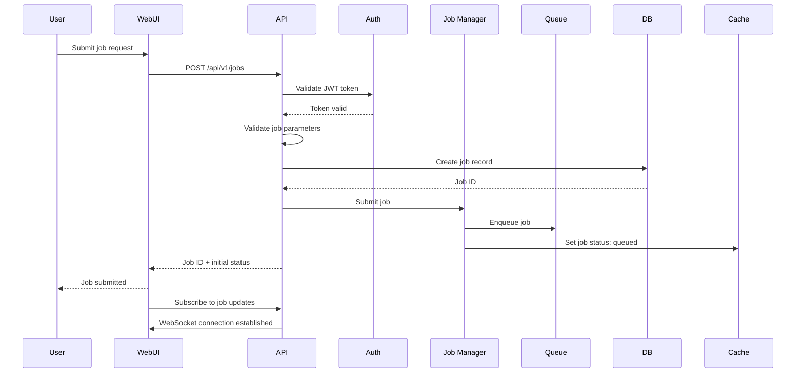

## Job Execution Flow

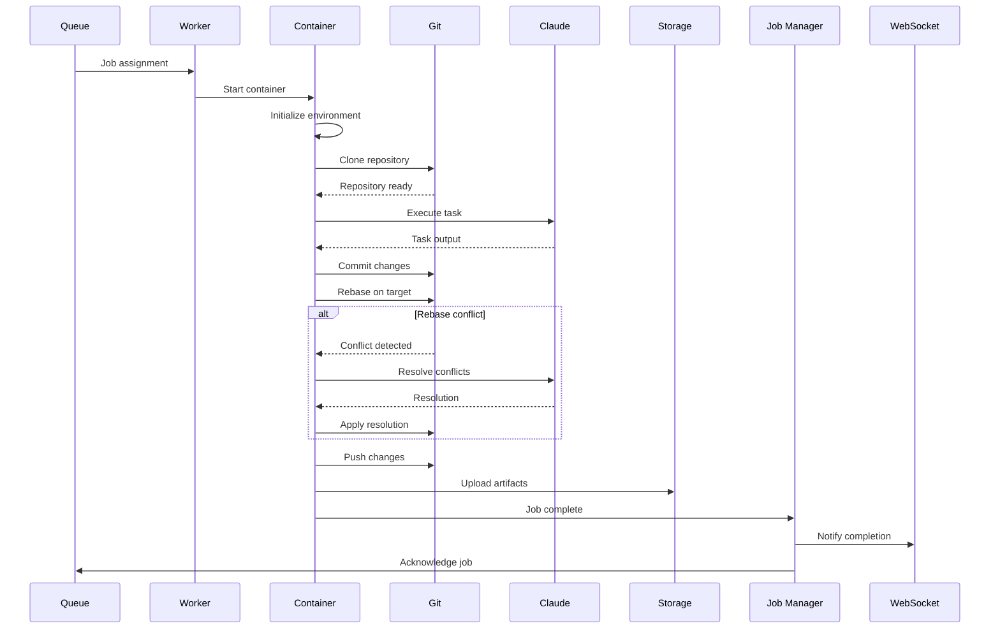

## Real-time Updates Flow

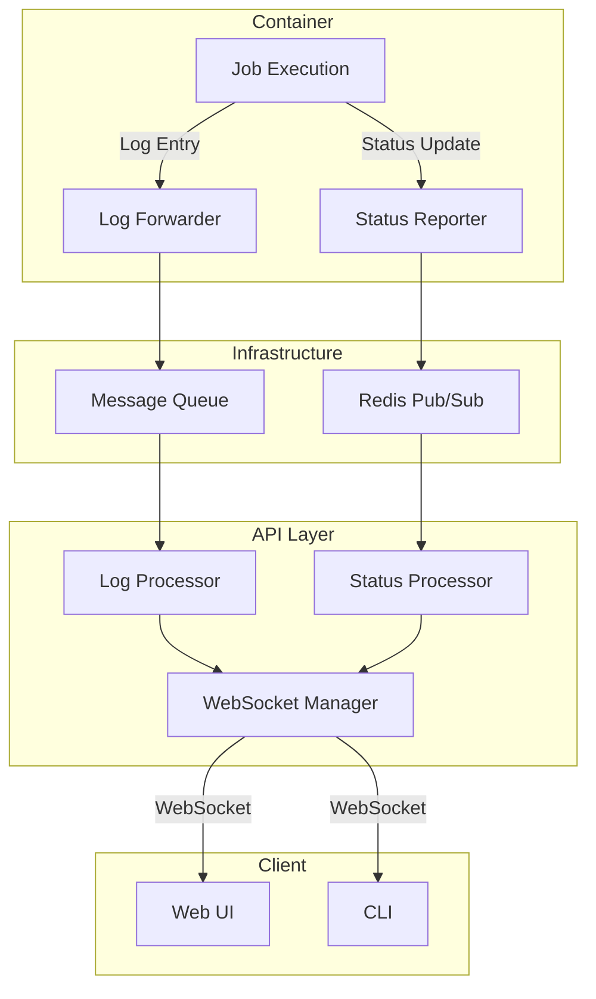

## Data Transformation Pipeline

### 1. Input Validation and Normalization

```typescript
// Job submission request
interface JobRequest {
  repositoryId: string;
  branch: string;
  targetBranch: string;
  task: string;
  environment?: Record<string, string>;
  priority?: 'low' | 'normal' | 'high';
}

// Internal job representation
interface InternalJob {
  id: UUID;
  userId: UUID;
  repository: {
    id: UUID;
    url: string;
    credentials: EncryptedCredentials;
  };
  execution: {
    branch: string;
    targetBranch: string;
    task: string;
    environment: Record<string, string>;
  };
  metadata: {
    priority: number;
    createdAt: Date;
    ttl: number;
    retryCount: number;
  };
}
```

### 2. Git Operations Data Flow

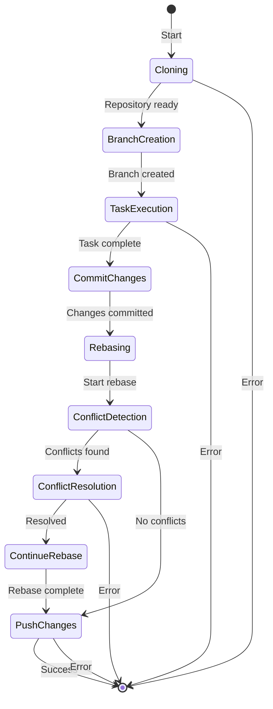

### 3. Claude Integration Data Flow

```python
# Conflict resolution prompt construction
def build_conflict_prompt(conflict: GitConflict) -> ClaudePrompt:
    return ClaudePrompt(
        system_message=CONFLICT_RESOLUTION_SYSTEM_PROMPT,
        context={
            "file_path": conflict.file_path,
            "base_branch": conflict.base_branch,
            "current_branch": conflict.current_branch,
            "surrounding_code": extract_context(conflict),
        },
        conflict_markers=conflict.raw_content,
        instructions=[
            "Analyze the conflict",
            "Understand the intent of both changes",
            "Provide a merged solution",
            "Ensure code correctness"
        ]
    )

# Response processing
def process_claude_response(response: ClaudeResponse) -> Resolution:
    return Resolution(
        content=extract_code_block(response.text),
        confidence=calculate_confidence(response),
        explanation=extract_explanation(response.text)
    )
```

## Event-Driven Architecture

### Event Types

```typescript
enum EventType {
  // Job lifecycle events
  JOB_CREATED = 'job.created',
  JOB_QUEUED = 'job.queued',
  JOB_STARTED = 'job.started',
  JOB_PROGRESS = 'job.progress',
  JOB_COMPLETED = 'job.completed',
  JOB_FAILED = 'job.failed',
  JOB_CANCELLED = 'job.cancelled',
  
  // Git events
  GIT_CLONE_STARTED = 'git.clone.started',
  GIT_CLONE_COMPLETED = 'git.clone.completed',
  GIT_CONFLICT_DETECTED = 'git.conflict.detected',
  GIT_CONFLICT_RESOLVED = 'git.conflict.resolved',
  GIT_PUSH_COMPLETED = 'git.push.completed',
  
  // System events
  WORKER_STARTED = 'worker.started',
  WORKER_STOPPED = 'worker.stopped',
  RATE_LIMIT_EXCEEDED = 'rate_limit.exceeded'
}
```

### Event Flow

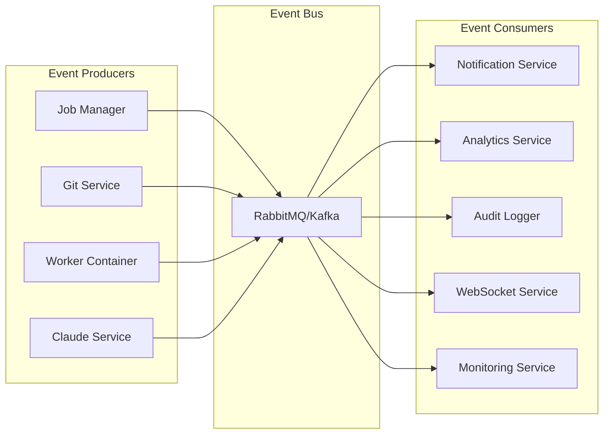

## Caching Strategy

### Cache Layers

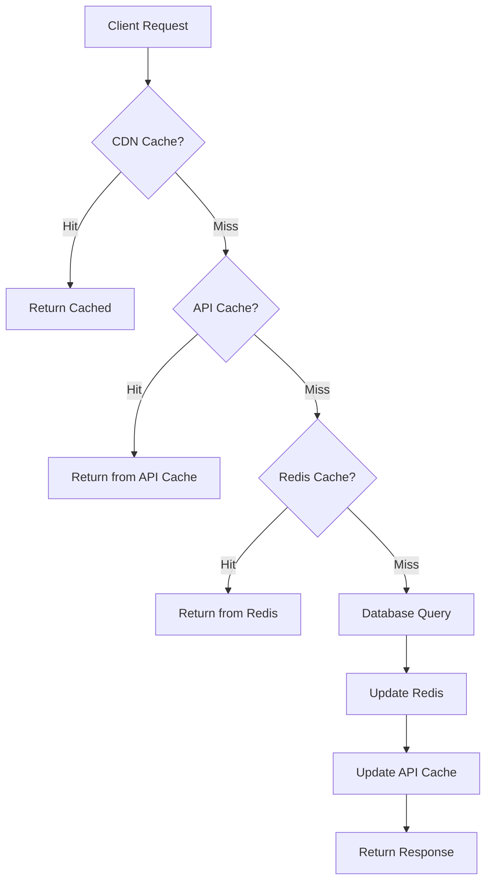

### Cache Patterns

```python
# Cache-aside pattern for job data
async def get_job(job_id: str) -> Job:
    # Try cache first
    cached = await redis.get(f"job:{job_id}")
    if cached:
        return Job.parse_raw(cached)
    
    # Load from database
    job = await db.get_job(job_id)
    if job:
        # Cache for 1 hour
        await redis.setex(
            f"job:{job_id}", 
            3600, 
            job.json()
        )
    
    return job

# Write-through cache for status updates
async def update_job_status(job_id: str, status: str):
    # Update database
    await db.update_job_status(job_id, status)
    
    # Update cache
    await redis.hset(
        f"job:{job_id}", 
        "status", 
        status
    )
    
    # Publish event
    await redis.publish(
        f"job.status.{job_id}", 
        status
    )
```

## Security Data Flow

### Authentication Flow

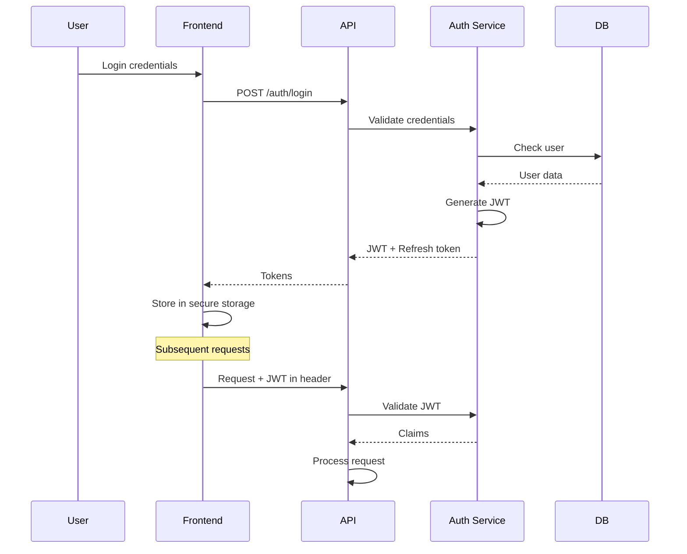

### Secret Management Flow

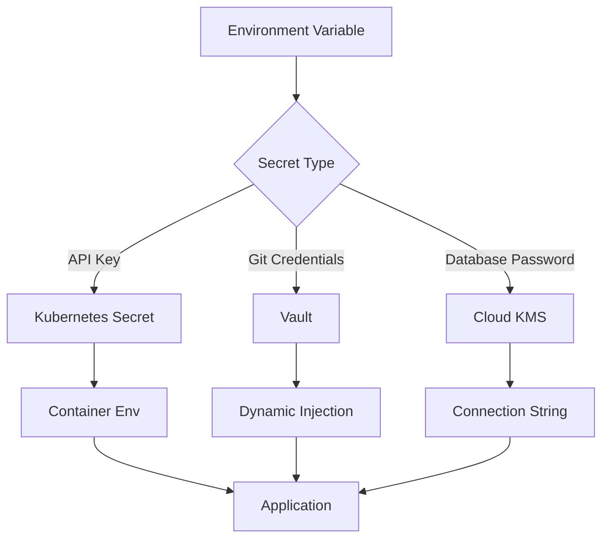

## Error Handling and Recovery

### Retry Logic

```typescript
interface RetryPolicy {
  maxAttempts: number;
  backoffType: 'exponential' | 'linear';
  initialDelay: number;
  maxDelay: number;
  retryableErrors: string[];
}

const jobRetryPolicy: RetryPolicy = {
  maxAttempts: 3,
  backoffType: 'exponential',
  initialDelay: 1000,
  maxDelay: 30000,
  retryableErrors: [
    'NETWORK_ERROR',
    'RATE_LIMIT',
    'CONTAINER_START_FAILED',
    'GIT_CLONE_FAILED'
  ]
};
```

### Error Propagation

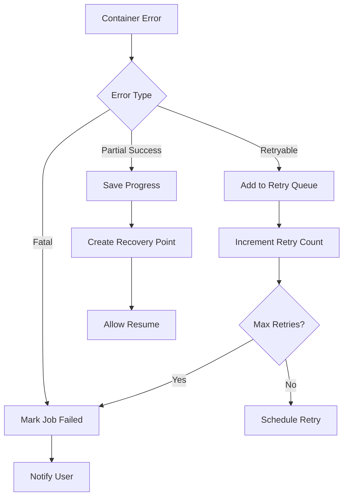

## Performance Optimization

### Batch Processing

```python
# Batch job status updates
async def batch_update_statuses():
    batch = []
    async for msg in redis.subscribe("job.status.*"):
        batch.append(msg)
        
        if len(batch) >= 100 or time_since_last() > 1:
            async with db.transaction():
                for update in batch:
                    await db.update_job_status(
                        update.job_id, 
                        update.status
                    )
            batch.clear()
```

### Pipeline Optimization

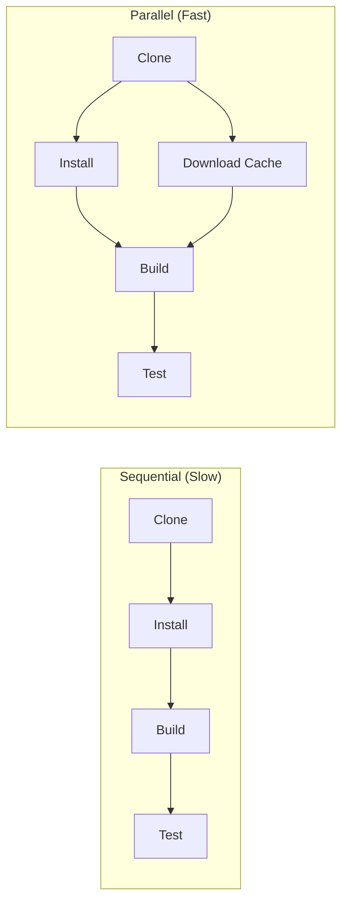

## Monitoring Data Flow

### Metrics Collection

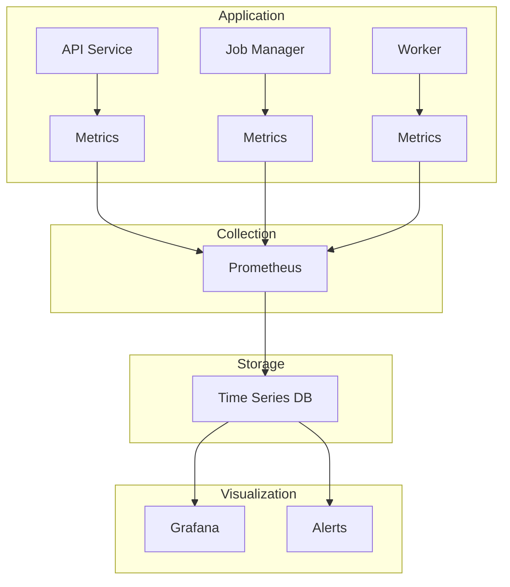

### Log Aggregation

```yaml
# Fluentd configuration
<source>
  @type forward
  port 24224
</source>

<filter app.**>
  @type record_transformer
  <record>
    service ${tag_parts[1]}
    environment ${ENV}
    cluster ${CLUSTER_NAME}
  </record>
</filter>

<match app.**>
  @type elasticsearch
  host elasticsearch.flowforge.local
  port 9200
  index_name flowforge-%Y.%m.%d
  <buffer>
    flush_interval 10s
    chunk_limit_size 5M
  </buffer>
</match>
```

## Data Retention and Archival

### Retention Policy

```sql
-- Archive completed jobs older than 30 days
INSERT INTO jobs_archive 
SELECT * FROM jobs 
WHERE completed_at < NOW() - INTERVAL '30 days'
  AND status IN ('success', 'failed', 'cancelled');

-- Clean up old logs
DELETE FROM job_logs 
WHERE created_at < NOW() - INTERVAL '7 days';

-- Compress and move artifacts to cold storage
UPDATE job_artifacts 
SET storage_class = 'GLACIER',
    compressed = true
WHERE created_at < NOW() - INTERVAL '90 days';
```