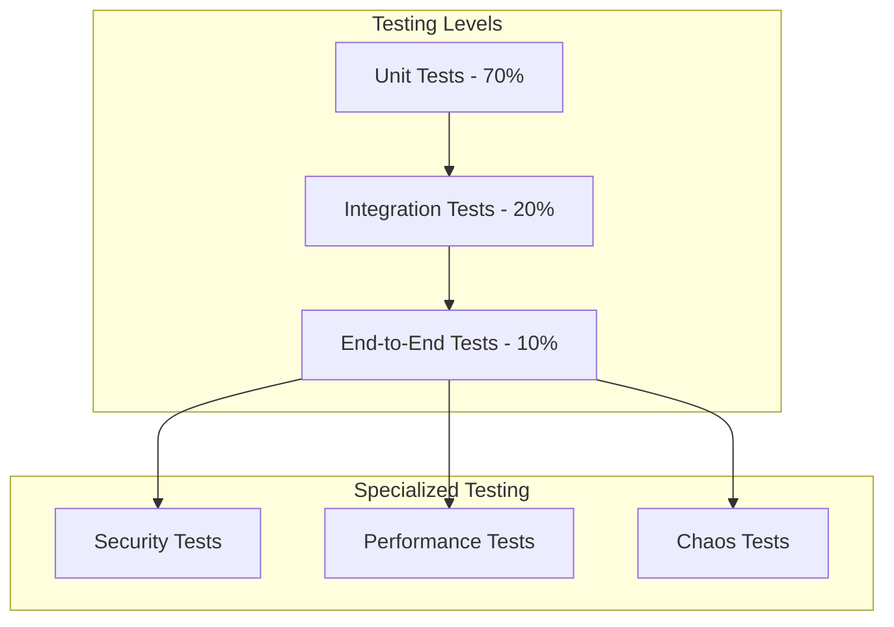

# FlowForge Testing Strategy

## Overview

This document outlines the comprehensive testing strategy for FlowForge, covering all levels of testing from unit tests to production monitoring. Our approach emphasizes test-driven development (TDD) and continuous quality assurance.

## Testing Philosophy

1. **Test Early, Test Often**: Write tests before or alongside code
2. **Automate Everything**: Manual testing should be the exception
3. **Fast Feedback**: Tests should run quickly and provide clear results
4. **Test in Production**: Monitor and validate in real environments
5. **Security as a Test**: Include security testing at all levels

## Testing Pyramid



## Unit Testing

### Backend (Go)

**Testing Framework**: Standard library + testify
```go
package gitservice

import (
    "testing"
    "github.com/stretchr/testify/assert"
    "github.com/stretchr/testify/mock"
)

func TestConflictResolver_ValidateResolution(t *testing.T) {
    tests := []struct {
        name     string
        conflict Conflict
        solution string
        expected bool
    }{
        {
            name: "valid python syntax",
            conflict: Conflict{
                FilePath: "main.py",
                Content:  "def hello():\n    pass",
            },
            solution: "def hello():\n    return 'world'",
            expected: true,
        },
        {
            name: "invalid python syntax",
            conflict: Conflict{
                FilePath: "main.py",
                Content:  "def hello():\n    pass",
            },
            solution: "def hello(\n    return 'world'",
            expected: false,
        },
    }
    
    resolver := NewConflictResolver()
    
    for _, tt := range tests {
        t.Run(tt.name, func(t *testing.T) {
            result := resolver.ValidateResolution(tt.conflict, tt.solution)
            assert.Equal(t, tt.expected, result.IsValid)
        })
    }
}

// Mock for Claude service
type MockClaudeService struct {
    mock.Mock
}

func (m *MockClaudeService) ResolveConflict(ctx context.Context, prompt string) (string, error) {
    args := m.Called(ctx, prompt)
    return args.String(0), args.Error(1)
}
```

### Frontend (TypeScript/React)

**Testing Framework**: Jest + React Testing Library
```typescript
// JobList.test.tsx
import { render, screen, waitFor } from '@testing-library/react';
import userEvent from '@testing-library/user-event';
import { JobList } from './JobList';
import { mockServer } from '../test/mockServer';

describe('JobList', () => {
  beforeEach(() => {
    mockServer.reset();
  });

  test('displays jobs and handles filtering', async () => {
    mockServer.get('/api/v1/jobs', {
      jobs: [
        { id: '1', status: 'running', repository: 'user/repo' },
        { id: '2', status: 'completed', repository: 'user/other' },
      ],
    });

    render(<JobList />);

    // Wait for jobs to load
    await waitFor(() => {
      expect(screen.getByText('user/repo')).toBeInTheDocument();
    });

    // Filter by status
    const filterSelect = screen.getByLabelText('Filter by status');
    await userEvent.selectOptions(filterSelect, 'running');

    // Only running job should be visible
    expect(screen.getByText('user/repo')).toBeInTheDocument();
    expect(screen.queryByText('user/other')).not.toBeInTheDocument();
  });

  test('handles WebSocket updates', async () => {
    const { rerender } = render(<JobList />);

    // Simulate WebSocket message
    mockServer.ws.send({
      type: 'job.status',
      jobId: '1',
      status: 'completed',
    });

    await waitFor(() => {
      expect(screen.getByTestId('job-1-status')).toHaveTextContent('completed');
    });
  });
});
```

## Integration Testing

### API Integration Tests

```go
// api_integration_test.go
func TestJobCreationFlow(t *testing.T) {
    // Setup test database
    db := setupTestDB(t)
    defer db.Close()
    
    // Create test server
    server := setupTestServer(db)
    
    // Test job creation
    payload := map[string]interface{}{
        "repository_id": "test-repo",
        "branch": "feature/test",
        "task": "Run tests",
    }
    
    resp := server.POST("/api/v1/jobs").
        WithJSON(payload).
        WithHeader("Authorization", "Bearer test-token").
        Expect()
    
    resp.Status(http.StatusCreated)
    resp.JSON().Path("$.id").String().NotEmpty()
    resp.JSON().Path("$.status").Equal("queued")
    
    // Verify job was created in database
    var job Job
    err := db.Get(&job, "SELECT * FROM jobs WHERE id = $1", resp.JSON().Path("$.id").Raw())
    assert.NoError(t, err)
    assert.Equal(t, "queued", job.Status)
}
```

### Git Service Integration Tests

```python
# test_git_integration.py
import pytest
from gitservice import SecureGitService
from unittest.mock import patch

class TestGitIntegration:
    @pytest.fixture
    def git_service(self):
        return SecureGitService()
    
    @pytest.mark.integration
    async def test_conflict_resolution_flow(self, git_service, tmp_path):
        # Create test repository
        repo_path = tmp_path / "test-repo"
        repo = await git_service.clone_repository(
            "https://github.com/test/repo.git",
            "main",
            depth=1
        )
        
        # Create conflicting changes
        await self._create_conflict(repo)
        
        # Attempt rebase
        result = await git_service.rebase_with_validation(repo, "main")
        
        assert not result.success
        assert len(result.conflicts) > 0
        
        # Verify conflict was resolved
        for conflict in result.conflicts:
            if conflict.resolution_method == "claude_validated":
                assert conflict.success
                assert conflict.validation_results["syntax"]
                assert conflict.validation_results["security"]
```

## End-to-End Testing

### Playwright Tests

```typescript
// e2e/job-workflow.spec.ts
import { test, expect } from '@playwright/test';

test.describe('Job Workflow', () => {
  test('complete job creation and execution flow', async ({ page }) => {
    // Login
    await page.goto('/login');
    await page.fill('[name="email"]', 'test@example.com');
    await page.fill('[name="password"]', 'password');
    await page.click('button[type="submit"]');
    
    // Navigate to jobs
    await page.waitForNavigation();
    await page.click('a[href="/jobs"]');
    
    // Create new job
    await page.click('button:has-text("New Job")');
    await page.selectOption('[name="repository"]', 'test-repo');
    await page.fill('[name="task"]', 'Update dependencies');
    await page.click('button:has-text("Create")');
    
    // Wait for job to complete
    await page.waitForSelector('.job-status:has-text("completed")', {
      timeout: 120000, // 2 minutes
    });
    
    // Verify results
    await page.click('.job-details-link');
    await expect(page.locator('.job-output')).toContainText('Successfully updated');
  });
});
```

### API Contract Testing

```yaml
# contracts/job-api.yaml
openapi: 3.0.0
info:
  title: Job API Contract
  version: 1.0.0
paths:
  /api/v1/jobs:
    post:
      requestBody:
        required: true
        content:
          application/json:
            schema:
              type: object
              required: [repository_id, branch, task]
              properties:
                repository_id:
                  type: string
                branch:
                  type: string
                task:
                  type: string
      responses:
        201:
          content:
            application/json:
              schema:
                type: object
                required: [id, status]
                properties:
                  id:
                    type: string
                    format: uuid
                  status:
                    type: string
                    enum: [queued, running, completed, failed]
```

## Security Testing

### Static Analysis

```yaml
# .github/workflows/security.yml
name: Security Scan
on: [push, pull_request]

jobs:
  security:
    runs-on: ubuntu-latest
    steps:
      - uses: actions/checkout@v3
      
      - name: Run Snyk Security Scan
        uses: snyk/actions/golang@master
        env:
          SNYK_TOKEN: ${{ secrets.SNYK_TOKEN }}
      
      - name: Run gosec
        run: |
          go install github.com/securego/gosec/v2/cmd/gosec@latest
          gosec -fmt sarif -out gosec.sarif ./...
      
      - name: Upload SARIF
        uses: github/codeql-action/upload-sarif@v2
        with:
          sarif_file: gosec.sarif
```

### Dynamic Security Testing

```go
// security_test.go
func TestSQLInjectionPrevention(t *testing.T) {
    attacks := []string{
        "'; DROP TABLE users; --",
        "1' OR '1'='1",
        "admin'--",
        "1; UPDATE users SET role='admin' WHERE id=1; --",
    }
    
    for _, attack := range attacks {
        t.Run(attack, func(t *testing.T) {
            resp := testServer.GET("/api/v1/jobs").
                WithQuery("search", attack).
                Expect()
            
            // Should handle safely
            resp.Status(http.StatusOK)
            
            // Verify no SQL was executed
            var count int
            db.Get(&count, "SELECT COUNT(*) FROM users")
            assert.Greater(t, count, 0, "Users table should still exist")
        })
    }
}
```

## Performance Testing

### Load Testing with k6

```javascript
// loadtest/job-creation.js
import http from 'k6/http';
import { check, sleep } from 'k6';
import { Rate } from 'k6/metrics';

const errorRate = new Rate('errors');

export const options = {
  stages: [
    { duration: '2m', target: 100 }, // Ramp up
    { duration: '5m', target: 100 }, // Stay at 100 users
    { duration: '2m', target: 200 }, // Ramp up more
    { duration: '5m', target: 200 }, // Stay at 200 users
    { duration: '2m', target: 0 },   // Ramp down
  ],
  thresholds: {
    http_req_duration: ['p(95)<500'], // 95% of requests under 500ms
    errors: ['rate<0.1'],             // Error rate under 10%
  },
};

export default function () {
  const payload = JSON.stringify({
    repository_id: 'test-repo',
    branch: 'main',
    task: 'performance test',
  });

  const params = {
    headers: {
      'Content-Type': 'application/json',
      'Authorization': `Bearer ${__ENV.API_TOKEN}`,
    },
  };

  const response = http.post(
    'https://api.flowforge.io/api/v1/jobs',
    payload,
    params
  );

  const success = check(response, {
    'status is 201': (r) => r.status === 201,
    'response time < 500ms': (r) => r.timings.duration < 500,
    'job id returned': (r) => JSON.parse(r.body).id !== undefined,
  });

  errorRate.add(!success);
  sleep(1);
}
```

### Benchmark Tests

```go
// benchmark_test.go
func BenchmarkConflictResolution(b *testing.B) {
    resolver := NewConflictResolver()
    conflict := generateTestConflict()
    
    b.ResetTimer()
    for i := 0; i < b.N; i++ {
        resolver.ValidateResolution(conflict, "solution")
    }
}

func BenchmarkJobCreation(b *testing.B) {
    db := setupBenchmarkDB()
    service := NewJobService(db)
    
    b.ResetTimer()
    b.RunParallel(func(pb *testing.PB) {
        for pb.Next() {
            service.CreateJob(context.Background(), JobRequest{
                RepositoryID: "bench-repo",
                Branch:       "main",
                Task:         "benchmark",
            })
        }
    })
}
```

## Chaos Engineering

### Litmus Chaos Experiments

```yaml
# chaos/network-delay.yaml
apiVersion: litmuschaos.io/v1alpha1
kind: ChaosEngine
metadata:
  name: network-chaos
spec:
  appinfo:
    appns: flowforge-prod
    applabel: app=flowforge-api
  chaosServiceAccount: litmus-admin
  experiments:
    - name: pod-network-latency
      spec:
        components:
          env:
            - name: NETWORK_INTERFACE
              value: eth0
            - name: NETWORK_LATENCY
              value: "200" # 200ms delay
            - name: TOTAL_CHAOS_DURATION
              value: "300" # 5 minutes
```

### Failure Injection Testing

```go
// chaos_test.go
func TestDatabaseFailureRecovery(t *testing.T) {
    // Start with healthy system
    server := setupTestServer()
    
    // Create job
    jobID := createTestJob(t, server)
    
    // Simulate database failure
    server.DB.Close()
    
    // Verify graceful degradation
    resp := server.GET("/api/v1/jobs/" + jobID).Expect()
    resp.Status(http.StatusServiceUnavailable)
    resp.JSON().Path("$.error").Equal("Database temporarily unavailable")
    
    // Restore database
    server.DB = reconnectDB()
    
    // Verify recovery
    resp = server.GET("/api/v1/jobs/" + jobID).Expect()
    resp.Status(http.StatusOK)
}
```

## Test Data Management

### Test Fixtures

```go
// fixtures/test_data.go
package fixtures

var TestRepositories = []Repository{
    {
        ID:   "test-repo-1",
        Name: "test/repo-1",
        URL:  "https://github.com/test/repo-1.git",
    },
    {
        ID:   "test-repo-2",
        Name: "test/repo-2",
        URL:  "https://github.com/test/repo-2.git",
    },
}

func LoadTestData(db *sql.DB) error {
    tx, err := db.Begin()
    if err != nil {
        return err
    }
    defer tx.Rollback()
    
    // Load repositories
    for _, repo := range TestRepositories {
        _, err := tx.Exec(
            "INSERT INTO repositories (id, name, url) VALUES ($1, $2, $3)",
            repo.ID, repo.Name, repo.URL,
        )
        if err != nil {
            return err
        }
    }
    
    return tx.Commit()
}
```

## Continuous Integration

### GitHub Actions Workflow

```yaml
# .github/workflows/test.yml
name: Test Suite
on: [push, pull_request]

jobs:
  unit-tests:
    runs-on: ubuntu-latest
    strategy:
      matrix:
        go-version: [1.20, 1.21]
    steps:
      - uses: actions/checkout@v3
      - uses: actions/setup-go@v4
        with:
          go-version: ${{ matrix.go-version }}
      
      - name: Run unit tests
        run: |
          go test -v -race -coverprofile=coverage.out ./...
          go tool cover -html=coverage.out -o coverage.html
      
      - name: Upload coverage
        uses: codecov/codecov-action@v3
        with:
          file: ./coverage.out

  integration-tests:
    runs-on: ubuntu-latest
    services:
      postgres:
        image: postgres:15
        env:
          POSTGRES_PASSWORD: test
        options: >-
          --health-cmd pg_isready
          --health-interval 10s
      redis:
        image: redis:7
        options: >-
          --health-cmd "redis-cli ping"
          --health-interval 10s
    
    steps:
      - uses: actions/checkout@v3
      - name: Run integration tests
        run: |
          go test -v -tags=integration ./...

  e2e-tests:
    runs-on: ubuntu-latest
    steps:
      - uses: actions/checkout@v3
      - name: Start services
        run: docker-compose up -d
      
      - name: Run E2E tests
        run: |
          npm install
          npx playwright install
          npx playwright test
      
      - uses: actions/upload-artifact@v3
        if: always()
        with:
          name: playwright-report
          path: playwright-report/
```

## Test Reporting

### Test Coverage Requirements

```yaml
# .codecov.yml
coverage:
  precision: 2
  round: down
  range: "70...100"
  
  status:
    project:
      default:
        target: 80%
        threshold: 2%
    patch:
      default:
        target: 90%
        threshold: 5%

comment:
  layout: "reach,diff,flags,files"
  behavior: default
```

### Test Dashboard

```javascript
// test-dashboard/metrics.js
const testMetrics = {
  unitTests: {
    total: 1250,
    passed: 1240,
    failed: 10,
    coverage: 85.2,
  },
  integrationTests: {
    total: 150,
    passed: 148,
    failed: 2,
    avgDuration: '2.3s',
  },
  e2eTests: {
    total: 25,
    passed: 25,
    failed: 0,
    avgDuration: '45s',
  },
  performance: {
    p95ResponseTime: '245ms',
    throughput: '1200 req/s',
    errorRate: '0.02%',
  },
};
```

## Testing Best Practices

1. **Write Tests First**: Follow TDD principles
2. **Keep Tests Fast**: Unit tests should run in milliseconds
3. **Test One Thing**: Each test should verify a single behavior
4. **Use Descriptive Names**: Test names should explain what they test
5. **Avoid Test Interdependence**: Tests should run in any order
6. **Mock External Dependencies**: Use interfaces for easy mocking
7. **Test Edge Cases**: Include boundary conditions and error paths
8. **Maintain Test Data**: Keep test fixtures up to date
9. **Review Test Code**: Test code deserves the same quality as production code
10. **Monitor Flaky Tests**: Track and fix unreliable tests

## Conclusion

This comprehensive testing strategy ensures FlowForge maintains high quality and reliability. By combining multiple testing approaches and automating everything, we can confidently deploy changes while maintaining system stability.