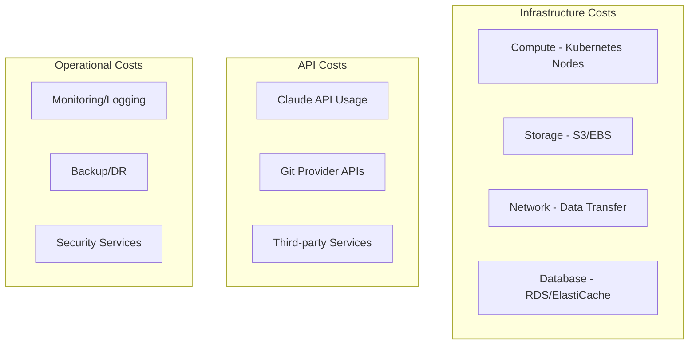

# FlowForge Cost Management Architecture

## Overview

This document outlines the comprehensive cost management and optimization strategy for FlowForge, focusing on tracking, controlling, and optimizing costs across all system components, with special attention to Claude API usage.

## Cost Components



## Claude API Cost Management

### Cost Tracking Architecture

```python
from decimal import Decimal
from datetime import datetime, timedelta
import asyncio
from typing import Dict, List, Optional

class ClaudeAPIUsageTracker:
    def __init__(self, db, redis):
        self.db = db
        self.redis = redis
        self.pricing = {
            'claude-3-opus': {
                'input': Decimal('0.015'),    # per 1K tokens
                'output': Decimal('0.075'),   # per 1K tokens
            },
            'claude-3-sonnet': {
                'input': Decimal('0.003'),
                'output': Decimal('0.015'),
            },
            'claude-3-haiku': {
                'input': Decimal('0.00025'),
                'output': Decimal('0.00125'),
            }
        }
    
    async def track_usage(self, request: ClaudeRequest, response: ClaudeResponse):
        """Track API usage and costs"""
        # Calculate cost
        input_cost = (request.prompt_tokens / 1000) * self.pricing[request.model]['input']
        output_cost = (response.completion_tokens / 1000) * self.pricing[request.model]['output']
        total_cost = input_cost + output_cost
        
        # Store in database
        await self.db.execute("""
            INSERT INTO claude_api_usage (
                organization_id, user_id, job_id, model,
                operation_type, prompt_tokens, completion_tokens,
                total_tokens, cost_usd, response_time_ms,
                cache_hit, created_at
            ) VALUES ($1, $2, $3, $4, $5, $6, $7, $8, $9, $10, $11, $12)
        """, request.org_id, request.user_id, request.job_id, request.model,
            request.operation_type, request.prompt_tokens, response.completion_tokens,
            request.prompt_tokens + response.completion_tokens, total_cost,
            response.response_time_ms, response.cache_hit, datetime.utcnow())
        
        # Update real-time counters
        await self._update_realtime_usage(request.org_id, request.user_id, total_cost)
        
        # Check budget alerts
        await self._check_budget_alerts(request.org_id, request.user_id)
        
        return UsageRecord(
            tokens_used=request.prompt_tokens + response.completion_tokens,
            cost_usd=total_cost,
            model=request.model
        )
    
    async def _update_realtime_usage(self, org_id: str, user_id: str, cost: Decimal):
        """Update real-time usage counters in Redis"""
        # Organization daily usage
        org_day_key = f"usage:org:{org_id}:day:{datetime.utcnow().date()}"
        await self.redis.incrbyfloat(org_day_key, float(cost))
        await self.redis.expire(org_day_key, 86400 * 7)  # Keep for 7 days
        
        # User monthly usage
        user_month_key = f"usage:user:{user_id}:month:{datetime.utcnow().strftime('%Y-%m')}"
        await self.redis.incrbyfloat(user_month_key, float(cost))
        await self.redis.expire(user_month_key, 86400 * 35)  # Keep for 35 days
```

### Budget Management

```python
class BudgetManager:
    def __init__(self, db, redis, notification_service):
        self.db = db
        self.redis = redis
        self.notifications = notification_service
    
    async def check_budget_before_request(
        self, 
        org_id: str, 
        user_id: str, 
        estimated_tokens: int,
        model: str
    ) -> BudgetCheckResult:
        """Check if request is within budget limits"""
        # Get applicable budgets
        budgets = await self._get_active_budgets(org_id, user_id)
        
        # Calculate estimated cost
        estimated_cost = self._calculate_estimated_cost(estimated_tokens, model)
        
        # Check each budget
        for budget in budgets:
            current_usage = await self._get_current_usage(
                budget.organization_id, 
                budget.user_id, 
                budget.period
            )
            
            if current_usage + estimated_cost > budget.amount_usd:
                return BudgetCheckResult(
                    allowed=False,
                    reason=f"{budget.period} budget exceeded",
                    budget_remaining=float(budget.amount_usd - current_usage),
                    estimated_cost=float(estimated_cost)
                )
        
        return BudgetCheckResult(
            allowed=True,
            estimated_cost=float(estimated_cost)
        )
    
    async def create_budget_alert(self, budget_id: str, current_usage: Decimal):
        """Create alert when budget threshold is reached"""
        budget = await self.db.fetchrow(
            "SELECT * FROM budgets WHERE id = $1", 
            budget_id
        )
        
        usage_percent = (current_usage / budget['amount_usd']) * 100
        
        if usage_percent >= budget['alert_threshold_percent']:
            await self.notifications.send_budget_alert(
                budget=budget,
                current_usage=current_usage,
                usage_percent=usage_percent
            )
            
            # Update alert status to prevent spam
            await self.redis.setex(
                f"budget:alert:{budget_id}",
                86400,  # Don't alert again for 24 hours
                "sent"
            )
```

### Cost Optimization Strategies

```python
class CostOptimizer:
    def __init__(self, cache_service, model_selector):
        self.cache = cache_service
        self.model_selector = model_selector
    
    async def optimize_claude_request(self, request: ClaudeRequest) -> OptimizedRequest:
        """Optimize request to reduce costs"""
        # 1. Check cache for similar requests
        cached_response = await self._check_semantic_cache(request)
        if cached_response:
            return OptimizedRequest(
                use_cache=True,
                cached_response=cached_response,
                savings=request.estimated_cost
            )
        
        # 2. Select appropriate model based on task complexity
        optimal_model = await self.model_selector.select_model(
            task_type=request.operation_type,
            complexity=request.estimated_complexity,
            budget_remaining=request.budget_remaining
        )
        
        # 3. Optimize prompt to reduce tokens
        optimized_prompt = await self._optimize_prompt(request.prompt)
        
        # 4. Batch similar requests if possible
        if request.can_batch:
            batch = await self._find_similar_pending_requests(request)
            if batch:
                return OptimizedRequest(
                    batch_with=batch,
                    savings=request.estimated_cost * 0.7  # 70% savings on batched
                )
        
        return OptimizedRequest(
            model=optimal_model,
            prompt=optimized_prompt,
            estimated_savings=(request.estimated_cost - 
                             self._calculate_cost(optimized_prompt, optimal_model))
        )
    
    async def _optimize_prompt(self, prompt: str) -> str:
        """Reduce prompt size while maintaining effectiveness"""
        # Remove redundant whitespace
        prompt = ' '.join(prompt.split())
        
        # Use references for repeated content
        prompt = self._replace_repeated_content(prompt)
        
        # Compress context where possible
        prompt = self._compress_context(prompt)
        
        return prompt

class SemanticCache:
    def __init__(self, vector_db, similarity_threshold=0.95):
        self.vector_db = vector_db
        self.threshold = similarity_threshold
    
    async def find_similar(self, prompt: str) -> Optional[CachedResponse]:
        """Find semantically similar cached responses"""
        # Generate embedding for prompt
        embedding = await self._generate_embedding(prompt)
        
        # Search vector database
        results = await self.vector_db.search(
            embedding=embedding,
            limit=5,
            min_similarity=self.threshold
        )
        
        if results:
            # Return best match
            return CachedResponse(
                response=results[0].response,
                similarity=results[0].similarity,
                original_cost=results[0].cost,
                cache_hit_time=datetime.utcnow()
            )
        
        return None
```

## Infrastructure Cost Management

### Kubernetes Cost Optimization

```yaml
# cost-optimization/cluster-autoscaler.yaml
apiVersion: v1
kind: ConfigMap
metadata:
  name: cluster-autoscaler-status
  namespace: kube-system
data:
  nodes.max: "20"
  nodes.min: "3"
  scale-down-delay-after-add: "10m"
  scale-down-unneeded-time: "10m"
  skip-nodes-with-system-pods: "true"
  balance-similar-node-groups: "true"
  expander: "least-waste"  # Optimize for cost
```

### Spot Instance Management

```go
// spot-instance-manager.go
type SpotInstanceManager struct {
    ec2Client *ec2.Client
    eksClient *eks.Client
}

func (s *SpotInstanceManager) CreateSpotNodeGroup(cluster string) error {
    // Define spot instance configuration
    spotConfig := &eks.CreateNodegroupInput{
        ClusterName: aws.String(cluster),
        NodegroupName: aws.String("workers-spot"),
        Subnets: getPrivateSubnets(),
        InstanceTypes: []string{
            "c5.large",
            "c5a.large",
            "c5n.large", // Diverse instance types for better availability
        },
        CapacityType: aws.String("SPOT"),
        ScalingConfig: &eks.NodegroupScalingConfig{
            DesiredSize: aws.Int32(2),
            MaxSize:     aws.Int32(10),
            MinSize:     aws.Int32(0),
        },
        Labels: map[string]string{
            "workload-type": "batch",
            "lifecycle":     "spot",
        },
        Taints: []eks.Taint{{
            Key:    aws.String("spot-instance"),
            Value:  aws.String("true"),
            Effect: aws.String("NoSchedule"),
        }},
    }
    
    _, err := s.eksClient.CreateNodegroup(context.Background(), spotConfig)
    return err
}
```

### Storage Optimization

```python
# storage-lifecycle-manager.py
class StorageLifecycleManager:
    def __init__(self, s3_client):
        self.s3 = s3_client
    
    def setup_lifecycle_policies(self, bucket_name: str):
        """Configure S3 lifecycle policies for cost optimization"""
        lifecycle_config = {
            'Rules': [
                {
                    'ID': 'ArchiveOldLogs',
                    'Status': 'Enabled',
                    'Transitions': [
                        {
                            'Days': 30,
                            'StorageClass': 'STANDARD_IA'
                        },
                        {
                            'Days': 90,
                            'StorageClass': 'GLACIER'
                        }
                    ],
                    'Filter': {
                        'Prefix': 'logs/'
                    }
                },
                {
                    'ID': 'DeleteOldArtifacts',
                    'Status': 'Enabled',
                    'Expiration': {
                        'Days': 180
                    },
                    'Filter': {
                        'Prefix': 'artifacts/'
                    }
                },
                {
                    'ID': 'IntelligentTiering',
                    'Status': 'Enabled',
                    'Transitions': [{
                        'Days': 0,
                        'StorageClass': 'INTELLIGENT_TIERING'
                    }],
                    'Filter': {
                        'Prefix': 'job-outputs/'
                    }
                }
            ]
        }
        
        self.s3.put_bucket_lifecycle_configuration(
            Bucket=bucket_name,
            LifecycleConfiguration=lifecycle_config
        )
```

## Cost Monitoring and Reporting

### Real-time Cost Dashboard

```typescript
// cost-dashboard/CostMetrics.tsx
import React from 'react';
import { LineChart, BarChart, PieChart } from '@/components/charts';

interface CostMetrics {
  daily: DailyCost[];
  byService: ServiceCost[];
  byTeam: TeamCost[];
  forecast: CostForecast;
}

export const CostDashboard: React.FC = () => {
  const [metrics, setMetrics] = useState<CostMetrics>();
  const [timeRange, setTimeRange] = useState('7d');
  
  useEffect(() => {
    fetchCostMetrics(timeRange).then(setMetrics);
  }, [timeRange]);
  
  return (
    <Dashboard>
      <MetricCard
        title="Current Month Spend"
        value={`$${metrics?.currentMonth.toFixed(2)}`}
        change={metrics?.monthOverMonth}
        forecast={metrics?.forecast.projected}
      />
      
      <LineChart
        title="Daily Costs"
        data={metrics?.daily}
        series={[
          { key: 'infrastructure', name: 'Infrastructure' },
          { key: 'claudeApi', name: 'Claude API' },
          { key: 'other', name: 'Other Services' }
        ]}
      />
      
      <PieChart
        title="Cost by Service"
        data={metrics?.byService}
        formatter={(value) => `$${value.toFixed(2)}`}
      />
      
      <BarChart
        title="Cost by Team"
        data={metrics?.byTeam}
        horizontal
        showBudget
      />
      
      <CostAnomalyAlert anomalies={metrics?.anomalies} />
    </Dashboard>
  );
};
```

### Cost Alerting

```python
# cost-alerting.py
class CostAnomalyDetector:
    def __init__(self, metrics_store, notification_service):
        self.metrics = metrics_store
        self.notifications = notification_service
    
    async def detect_anomalies(self):
        """Detect unusual cost patterns"""
        # Get historical data
        historical = await self.metrics.get_cost_history(days=30)
        
        # Calculate baseline
        baseline = self._calculate_baseline(historical)
        
        # Check current costs
        current = await self.metrics.get_current_costs()
        
        anomalies = []
        for service, cost in current.items():
            expected = baseline[service]
            deviation = abs(cost - expected.mean) / expected.std
            
            if deviation > 3:  # 3 standard deviations
                anomalies.append(CostAnomaly(
                    service=service,
                    current_cost=cost,
                    expected_cost=expected.mean,
                    deviation=deviation,
                    severity='high' if deviation > 5 else 'medium'
                ))
        
        # Send alerts
        for anomaly in anomalies:
            await self.notifications.send_cost_anomaly_alert(anomaly)
        
        return anomalies
```

## Cost Allocation and Chargeback

### Tag-based Cost Allocation

```yaml
# kubernetes/cost-allocation-tags.yaml
apiVersion: v1
kind: ConfigMap
metadata:
  name: cost-allocation-config
data:
  required-tags: |
    - team
    - environment
    - project
    - cost-center
  
  tag-policies: |
    - name: team-validation
      regex: "^(engineering|data|platform|security)$"
    - name: environment-validation
      regex: "^(dev|staging|prod)$"
    - name: project-validation
      regex: "^[a-z0-9-]+$"
```

### Cost Reports

```sql
-- Monthly cost report by team
WITH monthly_costs AS (
    SELECT 
        DATE_TRUNC('month', created_at) as month,
        organization_id,
        SUM(cost_usd) as total_cost,
        COUNT(DISTINCT user_id) as active_users,
        COUNT(*) as total_requests
    FROM claude_api_usage
    WHERE created_at >= DATE_TRUNC('month', CURRENT_DATE - INTERVAL '6 months')
    GROUP BY 1, 2
),
infrastructure_costs AS (
    SELECT 
        DATE_TRUNC('month', date) as month,
        organization_id,
        SUM(compute_cost + storage_cost + network_cost) as infra_cost
    FROM infrastructure_costs
    WHERE date >= DATE_TRUNC('month', CURRENT_DATE - INTERVAL '6 months')
    GROUP BY 1, 2
)
SELECT 
    m.month,
    o.name as organization,
    m.total_cost as api_cost,
    COALESCE(i.infra_cost, 0) as infrastructure_cost,
    m.total_cost + COALESCE(i.infra_cost, 0) as total_cost,
    m.active_users,
    m.total_requests,
    ROUND((m.total_cost + COALESCE(i.infra_cost, 0)) / m.active_users, 2) as cost_per_user
FROM monthly_costs m
JOIN organizations o ON m.organization_id = o.id
LEFT JOIN infrastructure_costs i ON m.month = i.month AND m.organization_id = i.organization_id
ORDER BY m.month DESC, total_cost DESC;
```

## Cost Optimization Recommendations

### Automated Recommendations Engine

```python
class CostRecommendationEngine:
    def __init__(self, usage_analyzer, cost_calculator):
        self.analyzer = usage_analyzer
        self.calculator = cost_calculator
    
    async def generate_recommendations(self, org_id: str) -> List[Recommendation]:
        recommendations = []
        
        # Analyze usage patterns
        usage = await self.analyzer.analyze_organization(org_id)
        
        # 1. Model optimization
        if usage.claude_usage.opus_percentage > 0.3:
            potential_savings = self._calculate_model_downgrade_savings(usage)
            if potential_savings > 100:  # $100/month
                recommendations.append(Recommendation(
                    type="model_optimization",
                    title="Consider using Claude Sonnet for simpler tasks",
                    description=f"You're using Claude Opus for {usage.claude_usage.opus_percentage*100:.0f}% of requests. "
                               f"Switching appropriate tasks to Sonnet could save ${potential_savings:.2f}/month.",
                    priority="high",
                    estimated_savings=potential_savings
                ))
        
        # 2. Caching opportunities
        cache_analysis = await self.analyzer.analyze_cache_potential(org_id)
        if cache_analysis.cacheable_requests > 0.2:
            recommendations.append(Recommendation(
                type="caching",
                title="Enable semantic caching",
                description=f"{cache_analysis.cacheable_requests*100:.0f}% of your requests are similar. "
                           f"Caching could save ${cache_analysis.potential_savings:.2f}/month.",
                priority="medium",
                estimated_savings=cache_analysis.potential_savings
            ))
        
        # 3. Infrastructure optimization
        if usage.infrastructure.spot_eligible_workloads > 0.5:
            recommendations.append(Recommendation(
                type="infrastructure",
                title="Use spot instances for batch workloads",
                description="Over 50% of your workloads are batch jobs that could run on spot instances, "
                           "potentially saving 70% on compute costs.",
                priority="high",
                estimated_savings=usage.infrastructure.compute_cost * 0.35
            ))
        
        return sorted(recommendations, key=lambda r: r.estimated_savings, reverse=True)
```

## Budget Enforcement

### Hard Limits Implementation

```go
// budget-enforcer.go
type BudgetEnforcer struct {
    db     *sql.DB
    redis  *redis.Client
    logger *zap.Logger
}

func (b *BudgetEnforcer) EnforceLimit(ctx context.Context, req *JobRequest) error {
    // Check organization budget
    orgBudget, err := b.getActiveBudget(req.OrganizationID, "organization")
    if err != nil {
        return err
    }
    
    currentUsage, err := b.getCurrentUsage(req.OrganizationID, orgBudget.Period)
    if err != nil {
        return err
    }
    
    if currentUsage >= orgBudget.AmountUSD {
        // Hard stop - reject request
        b.logger.Warn("Budget exceeded, rejecting request",
            zap.String("org_id", req.OrganizationID),
            zap.Float64("budget", orgBudget.AmountUSD),
            zap.Float64("usage", currentUsage))
        
        return ErrBudgetExceeded{
            Budget:       orgBudget.AmountUSD,
            CurrentUsage: currentUsage,
            Period:       orgBudget.Period,
        }
    }
    
    // Soft warning at 80%
    if currentUsage >= orgBudget.AmountUSD*0.8 {
        b.sendBudgetWarning(req.OrganizationID, currentUsage, orgBudget)
    }
    
    return nil
}
```

## Cost Governance

### FinOps Implementation

```yaml
# finops/governance-policy.yaml
apiVersion: policy/v1
kind: CostGovernancePolicy
metadata:
  name: flowforge-cost-policy
spec:
  rules:
    - name: require-cost-tags
      enforcement: deny
      resources:
        - deployments
        - services
        - jobs
      require:
        tags:
          - cost-center
          - team
          - environment
    
    - name: claude-model-restrictions
      enforcement: warn
      conditions:
        - userRole: not-in [admin, power-user]
      restrictions:
        - model: claude-3-opus
          maxRequestsPerDay: 10
          requireApproval: true
    
    - name: infrastructure-limits
      enforcement: deny
      limits:
        - resource: compute
          maxNodesPerTeam: 20
          maxCostPerMonth: 5000
        - resource: storage
          maxTBPerTeam: 10
          maxCostPerMonth: 1000
  
  reporting:
    schedule: "0 9 * * MON"  # Weekly on Monday
    recipients:
      - engineering-managers@flowforge.io
      - finance@flowforge.io
    includeRecommendations: true
```

## Conclusion

This comprehensive cost management architecture ensures FlowForge operates efficiently while providing transparency and control over expenses. Key features include:

1. **Real-time Tracking**: Immediate visibility into costs
2. **Proactive Optimization**: Automated recommendations and optimizations
3. **Budget Control**: Hard and soft limits with alerting
4. **Cost Attribution**: Clear allocation to teams and projects
5. **Continuous Improvement**: Regular analysis and optimization

By implementing these cost management strategies, FlowForge can scale efficiently while maintaining predictable and optimized costs.